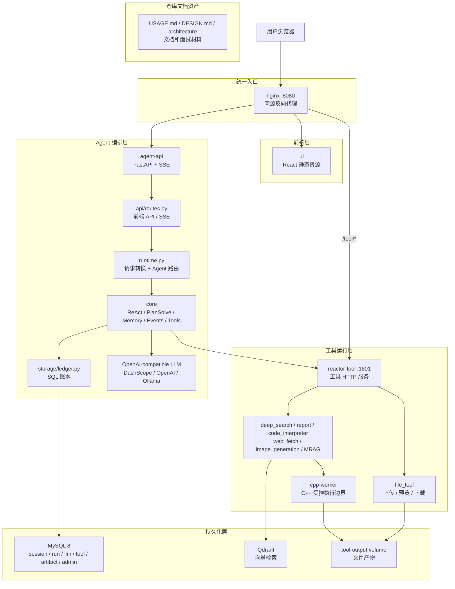
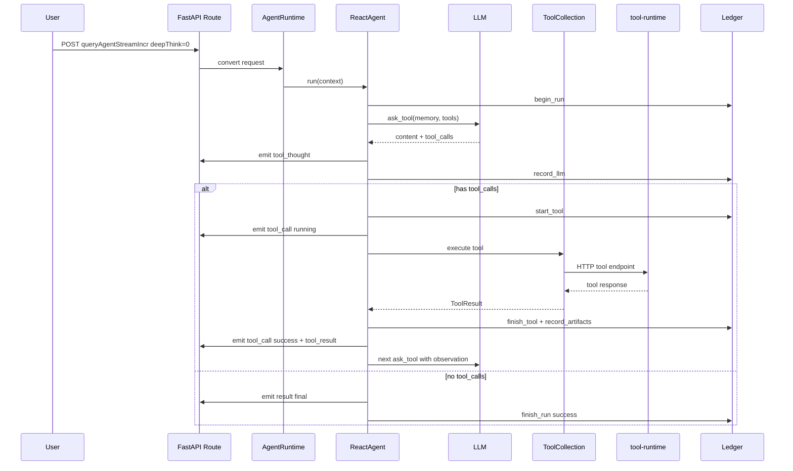
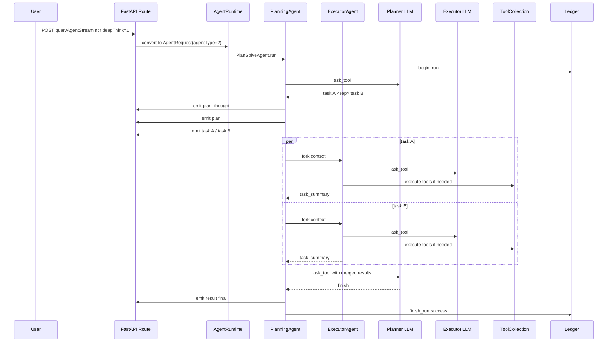

# Python+C++ Agent 设计说明

这份文档解释当前 Python+C++ 主链路每个部分的设计。它不是只给一个高层架构图，而是把服务边界、模块职责、数据模型、SSE 协议、Agent 循环、工具调用、C++ worker、部署和测试都拆开讲清楚，方便学习、面试和后续开发。

## 1. 设计目标

当前系统围绕 AI Agent 主链路设计，核心价值在于：

- 支持 ReAct 模式。
- 支持 PlanSolve 模式。
- 支持 SSE 流式返回。
- 支持工具调用，例如 deep search、report、code interpreter、image generation、data analysis、MRAG。
- 支持会话、运行记录、LLM 调用记录、工具调用记录和 artifact 记录。
- 支持前端 React UI。
- 支持 Admin 通用配置管理。

技术分工：

- Python 负责 HTTP、SSE、Agent 编排、ORM、业务协议、工具适配。
- C++ 只负责底层执行边界，例如受控命令执行、超时、退出码、stdout/stderr、文件产物扫描、sha256。
- `reactor-tool` 作为工具运行时，承接搜索、报告、代码解释器、图片生成、MRAG/RAG 和文件服务。
- React 前端 UI 作为工作台，通过同源代理访问后端。
- 数据库使用 MySQL 8，版本管理使用 Alembic。
- 向量检索使用 Qdrant。
- 文件产物先使用 Docker volume + HTTP 预览下载。

这个选择背后的理由：

- Python 对 LLM、FastAPI、异步 IO、Pydantic、SQLAlchemy 生态更友好。
- C++ 更适合做低层执行边界，但不适合承担 LLM/SSE/ORM 主业务。
- 工具运行时独立部署，能隔离重依赖和长耗时任务。
- 前端通过稳定协议接入，能降低交互链路改动风险。

## 2. 总体架构

当前运行时只保留五类核心能力：前端、agent-api、tool-runtime、cpp-worker、持久化服务。



服务职责：

| 服务 | 位置 | 职责 |
| --- | --- | --- |
| `ui` | `ui` | React 前端，构建成静态资源 |
| `nginx` | `deploy/nginx.conf` | 同源代理 UI、agent-api、tool-runtime |
| `agent-api` | `services/agent-api` | API、SSE、Agent 编排、账本、Admin 兼容 |
| `tool-runtime` | `reactor-tool` | deep search、report、code interpreter、image generation、MRAG、文件服务 |
| `cpp-worker` | `services/cpp-worker` | 低层命令执行、超时、stdout/stderr、文件扫描、hash |
| `mysql` | Docker service | 持久化会话、run、LLM、tool、artifact、Admin 配置 |
| `qdrant` | Docker service | 向量检索 |

### 2.1 瘦身边界

项目瘦身采用主线收敛策略：删除确定不参与当前 Python+C++ 功能的生成物、展示样例资产、重复依赖锁和本地缓存，让工作树只保留可运行主链路代码。

已删除或排除的内容：

- 本地虚拟环境、`__pycache__`、`*.pyc` 等可再生文件。
- `.DS_Store`、`.codegraph` 等本地系统或索引生成物。
- 展示样例 HTML/图片资产。
- 重复的 `ui/package-lock.json`，前端依赖锁以 `pnpm-lock.yaml` 为准。
- 不参与 Linux Docker 运行时的本地辅助二进制。

保留的内容：

- `reactor-tool`：当前工具运行时，必须保留。
- `ui`：当前 React UI，必须保留。
- `services/agent-api`：Python 编排服务，必须保留。
- `services/cpp-worker`：C++ worker，必须保留。

`.dockerignore` 额外排除了 assets、runtime、文档、本地缓存、虚拟环境和非运行资产。Docker 镜像只复制 `services/agent-api`、`services/cpp-worker`、`reactor-tool`、`ui` 和 `deploy/nginx.conf` 等运行相关内容。

## 3. 模块职责映射

| 系统职责 | Python/C++ 位置 | 设计说明 |
| --- | --- | --- |
| HTTP API | `services/agent-api/agent_api/api` | FastAPI route |
| 应用编排 | `services/agent-api/agent_api/runtime.py` | runtime 编排 |
| Agent 运行时 | `services/agent-api/agent_api/core` | agent、memory、tool、event、ledger 接口 |
| 持久化基础设施 | `services/agent-api/agent_api/storage` | SQLAlchemy model、SQL ledger、Alembic |
| 工具运行时 | `reactor-tool` | deep search、report、code interpreter、MRAG/RAG 等 |
| SSE 输出 | FastAPI `StreamingResponse` | 每帧 `data: JSON` |
| 并发执行 | `asyncio.gather`、`asyncio.Semaphore` | 工具和 PlanSolve 子任务并发 |
| 请求响应和持久化 | Pydantic schema + SQLAlchemy model | 请求响应和持久化分离 |
| script/runtime 边界 | C++ worker | 低层执行隔离 |

## 4. agent-api 服务设计

`agent-api` 是当前 Agent 编排服务。

目录：

```text
services/agent-api
├── agent_api
│   ├── api
│   │   ├── app.py
│   │   ├── routes.py
│   │   └── schemas.py
│   ├── core
│   │   ├── agents.py
│   │   ├── context.py
│   │   ├── events.py
│   │   ├── ledger.py
│   │   ├── llm.py
│   │   ├── memory.py
│   │   └── tools.py
│   ├── integrations
│   │   ├── openai_llm.py
│   │   └── tool_runtime.py
│   ├── storage
│   │   ├── ledger.py
│   │   ├── models.py
│   │   └── session.py
│   ├── main.py
│   ├── runtime.py
│   └── settings.py
├── alembic
├── scripts
└── tests
```

### 4.1 `settings.py`

`Settings` 使用 `pydantic-settings`，所有环境变量前缀都是 `REACTOR_`。

关键配置：

| 字段 | 环境变量 | 作用 |
| --- | --- | --- |
| `database_url` | `REACTOR_DATABASE_URL` | SQLAlchemy 数据库连接 |
| `tool_runtime_base_url` | `REACTOR_TOOL_RUNTIME_BASE_URL` | tool-runtime 地址 |
| `openai_base_url` | `REACTOR_OPENAI_BASE_URL` | OpenAI-compatible base url |
| `openai_api_key` | `REACTOR_OPENAI_API_KEY` | LLM key |
| `planner_model` | `REACTOR_PLANNER_MODEL` | PlanSolve planner 模型 |
| `executor_model` | `REACTOR_EXECUTOR_MODEL` | PlanSolve executor 模型 |
| `react_model` | `REACTOR_REACT_MODEL` | ReAct 模型 |
| `summary_model` | `REACTOR_SUMMARY_MODEL` | 预留 summary 模型 |
| `fake_llm` | `REACTOR_FAKE_LLM` | 无 key 时走 demo LLM |
| `ledger_backend` | `REACTOR_LEDGER_BACKEND` | `sql` 或 `memory` |
| `max_steps` | `REACTOR_MAX_STEPS` | Agent 最大循环步数 |
| `max_parallel_tasks` | `REACTOR_MAX_PARALLEL_TASKS` | PlanSolve 子任务并发数 |

设计点：

- `fake_llm=true` 方便无 API Key 验证全链路。
- `ledger_backend=memory` 适合单元测试和临时调试。
- `ledger_backend=sql` 是默认生产路径。

### 4.2 `api/app.py`

`create_app()` 创建 FastAPI app：

- 加载 settings。
- 添加 CORS middleware。
- include 主 router。

它不直接写业务逻辑，保持 app 工厂干净，方便测试用 `TestClient(create_app())`。

### 4.3 `api/schemas.py`

这一层是 Pydantic DTO。

重要 schema：

- `ResponseEnvelope`：统一响应结构，默认 `code="0000"`、`info="success"`。
- `FileInformation`：前端文件字段，例如 `fileName`、`ossUrl`、`domainUrl`、`fileSize`。
- `AgentMessage`：前端消息、tool_calls、artifact_refs、上传文件。
- `AgentRequest`：新 Python 主入口 `/AutoAgent` 使用。
- `GptQueryRequest`：前端主入口 `/web/api/v1/gpt/queryAgentStreamIncr`。
- `VisitorNamingRequest`：访客命名。
- `WorkspaceImageGenerationRequest`：图片生成。

设计点：

- 使用 `populate_by_name=True`，使 Python snake_case 和前端 camelCase 都能兼容。
- 保持前端字段语义稳定，但不把接口 schema 和持久化模型强行耦合。

### 4.4 `api/routes.py`

这一层提供对外 HTTP 和 SSE。

核心路由：

| 路由 | 方法 | 用途 |
| --- | --- | --- |
| `/web/health` | GET | 健康检查 |
| `/AutoAgent` | POST | 新 Agent 主入口 |
| `/web/api/v1/gpt/queryAgentStreamIncr` | POST | 前端主 Agent 入口 |
| `/api/agent/visitor/bootstrap` | GET | 访客初始化 |
| `/api/agent/visitor/naming` | POST | 访客命名 |
| `/api/agent/conversation/sessions` | GET | 会话列表 |
| `/api/agent/conversation/sessions/{session_id}` | GET | 会话详情 |
| `/api/agent/file/upload` | POST | 文件上传 |
| `/api/agent/image-generation/generate` | POST | 图片生成 |
| `/api/agent/image-generation/history` | GET | 图片历史占位 |
| `/api/agent/role-library/list` | GET | 角色库 |
| `/data/allModels` | GET | dataAgent 模型列表占位 |
| `/data/previewData` | GET | dataAgent 预览数据占位 |
| `/data/chatQuery` | POST | dataAgent SSE 兼容 |
| `/data/{path:path}` | POST | data 兼容 fallback |
| `/api/v1/admin/{resource}/{action:path}` | GET/POST/PUT/DELETE | Admin CRUD 通用兼容 |

#### SSE 设计

主 Agent SSE：

```text
data: {"messageType":"tool_thought","data":"...","isFinal":false}

data: {"messageType":"result","data":{"taskSummary":"..."},"isFinal":true}
```

关键约束：

- 每一帧 `data:` 必须是 JSON。
- 不输出 `[DONE]`。
- 结束时直接关闭连接。

原因是前端 `ui/src/utils/querySSE.ts` 会对每条 `event.data` 执行 `JSON.parse`。

dataAgent SSE：

```json
{"eventType":"THINK","data":"正在分析问题：..."}
{"eventType":"CHART_DATA","data":[]}
{"eventType":"READY"}
```

这是为了匹配前端 `parseDataChatEvent` 的 Zod schema。

#### Runtime 单例

`routes.py` 中用 `lru_cache(maxsize=1)` 复用 `AgentRuntime`：

- 避免每个请求都创建新 runtime。
- 内存账本模式下，会话历史不会每次请求清空。
- SQL 模式下，也减少重复创建 engine/session factory。

测试里可以用 FastAPI dependency override 替换 `get_runtime`。

### 4.5 `runtime.py`

`AgentRuntime` 是 API 层和 Agent 核心之间的桥。

职责：

1. 保存 settings。
2. 根据 `ledger_backend` 创建账本。
3. 把前端请求 `GptQueryRequest` 转成内部 `AgentRequest`。
4. 为每次请求创建 `AgentContext`。
5. 注册 tool-runtime 工具。
6. 根据 `agentType` 或 `deepThink` 路由到 ReAct 或 PlanSolve。
7. 把 Agent 事件通过 queue 变成 async iterator，供 SSE route 输出。

`convert_gpt_query()` 的关键逻辑：

- `request_id = traceId or requestId or uuid`
- `deepThink=0` -> `agentType=1`
- `deepThink=1` -> `agentType=2`
- 兼容 `sessionFiles`、`outputStyle`、`aiAgentId`

`stream_agent()` 的关键逻辑：

```text
create Queue
create QueueEventSink
create ToolCollection
register tool-runtime tools
create AgentContext
create async task run_agent()
while queue has event:
    yield event
finally await task
```

设计点：

- Agent 核心不直接依赖 FastAPI。
- SSE 输出和 Agent 执行解耦。
- Agent 抛异常时，会发一个 final `result` 事件，避免前端一直 loading。

### 4.6 `core/context.py`

`AgentContext` 是一次运行的上下文。

字段：

| 字段 | 含义 |
| --- | --- |
| `request_id` | 一次 run 的请求 ID |
| `session_id` | 会话 ID |
| `query` | 当前任务或用户问题 |
| `events` | 事件 sink |
| `ledger` | 账本 |
| `tools` | 工具集合 |
| `memory` | 对话记忆 |
| `entry_agent` | 当前入口 agent 名称 |

重要方法：

- `ensure_user_query_in_memory()`：如果 memory 为空，写入用户 query。
- `fork_for_task(task)`：PlanSolve 执行子任务时复制父 memory，并把子任务作为新的 user message。

设计点：

- context 把运行需要的对象集中传递，避免函数参数越来越长。
- fork 子任务时共享 ledger、tools、events，但复制 memory，这是 PlanSolve 并发子任务的关键。

### 4.7 `core/memory.py`

`Memory` 保存消息列表。

典型消息：

- user：用户问题
- assistant：模型回复，可携带 tool calls
- tool：工具 observation

对 OpenAI-compatible LLM，message 会被转成：

```json
{"role":"user","content":"..."}
{"role":"assistant","content":"...","tool_calls":[...]}
{"role":"tool","content":"...","tool_call_id":"..."}
```

设计点：

- Memory 不绑定某个 LLM vendor。
- OpenAI message 转换放在 message 层，LLM adapter 可以直接复用。

### 4.8 `core/llm.py`

核心类型：

- `ToolCall`：模型要求调用的工具。
- `ToolCallResponse`：模型响应，包含文本、tool_calls、token 统计。
- `ScriptedLLM`：测试用 LLM，按脚本返回固定响应。
- `ToolCapableLLM`：协议类型，要求实现 `ask_tool(context, agent_name)`。

设计点：

- Agent 核心只认 `ask_tool`，不关心真实模型还是测试模型。
- `ScriptedLLM` 让 ReAct/PlanSolve 测试不需要真实模型。

### 4.9 `integrations/openai_llm.py`

`OpenAICompatibleLLM` 使用 OpenAI-compatible Chat Completions。

关键逻辑：

1. 如果没有 API key，runtime 会返回 `DemoLLM`。
2. 构造 system prompt。
3. 把 memory 转成 OpenAI messages。
4. 把 `ToolCollection.describe_for_llm()` 转成 function tools。
5. 调用 `AsyncOpenAI.chat.completions.create()`。
6. 把返回的 tool calls 解析成内部 `ToolCall`。
7. 返回 `ToolCallResponse`。

默认 system prompt：

- planning：拆任务，用 `<sep>` 分隔并发步骤，完成时回复 `finish`。
- executor：围绕子任务选择工具或直接完成。
- react：根据用户问题选择工具或直接回答。

`DemoLLM` 的作用：

- fake LLM 模式下能跑通链路。
- planning 第一次返回 `检索资料<sep>整理报告`，第二次返回 `finish`。
- executor 返回 `已完成：{context.query}`。
- react 返回 `已收到：{context.query}`。

设计点：

- Demo 不是智能模型，只是本地链路验证器。
- 真正效果取决于 OpenAI-compatible 模型和 prompts。

### 4.10 `core/tools.py`

核心类型：

- `ToolResult`：工具执行结果。
- `ToolCollection`：工具注册表和调度器。

`ToolResult` 字段：

| 字段 | 含义 |
| --- | --- |
| `tool_result` | 给业务展示或记录的结果 |
| `llm_observation` | 回填给 LLM 的 observation |
| `structured_output` | 原始结构化输出 |
| `files` | 产物文件列表 |
| `failed` | 是否失败 |
| `error_msg` | 错误信息 |

`ToolCollection` 能：

- 注册 local tool。
- 给 LLM 描述可用工具。
- 根据名字执行工具。
- 返回 provider，用于 ledger 记录。

设计点：

- Agent 不直接依赖 HTTP tool-runtime。
- 未来可以扩展 MCP、skill/script、本地 Python tool，只要注册进 ToolCollection。

### 4.11 `integrations/tool_runtime.py`

这一层把 `reactor-tool` 包装成 Agent 可调用工具。

`ToolRuntimeClient`：

- `post_json(path, payload)`：调用 JSON API。
- `upload_file_data(...)`：multipart 上传文件。
- 支持注入 httpx transport，方便测试 mock。

注册的工具：

| Agent 工具名 | tool-runtime endpoint |
| --- | --- |
| `deep_search` | `/v1/tool/deepsearch` |
| `web_fetch` | `/v1/tool/web_fetch` |
| `report_tool` | `/v1/tool/report` |
| `code_interpreter` | `/v1/tool/code_interpreter` |
| `image_generation` | `/v1/tool/image_generation` |

`_normalize_response()` 把 tool-runtime 的 response 统一成 `ToolResult`：

- `data` -> `tool_result`
- `data` 或 `message` -> `llm_observation`
- `fileInfo` 或 `file_info` -> `files`
- `code` 非成功 -> `failed`

设计点：

- tool-runtime response 格式不完全统一，所以这里做兼容归一。
- Agent 核心只处理 `ToolResult`。

### 4.12 `core/events.py`

`Event` 是 Agent 内部事件。

字段：

- `type`
- `payload`
- `message_id`
- `is_final`
- `result_map`

`to_sse_data()` 输出：

```json
{
  "messageType": "result",
  "data": {"taskSummary": "..."},
  "isFinal": true
}
```

事件 sink：

- `EventCollector`：测试用，收集到 list。
- `QueueEventSink`：SSE 用，emit 后放入 asyncio queue。

设计点：

- Agent 不直接 yield HTTP 文本。
- 同一套事件可以用于测试、SSE、未来持久化回放。

### 4.13 `core/agents.py`

这是 Agent 核心。

#### BaseAgent

公共能力：

- `_ask_tool(step_no)`
  - 调 LLM。
  - 记录 LLM invocation。
  - 返回 `ToolCallResponse`。

- `_execute_tool_call(tool_call, step_no)`
  - 找 provider。
  - ledger.start_tool。
  - emit `tool_call` running。
  - tools.execute。
  - ledger.finish_tool。
  - ledger.record_artifacts。
  - emit `tool_call` success/failed。
  - 返回 `ToolResult`。

#### ReactAgent

循环逻辑：

```text
begin_run
ensure user query in memory
for step in 1..max_steps:
    response = ask_tool
    emit tool_thought if content exists
    add assistant message
    if no tool_calls:
        emit result
        finish_run success
        return
    execute all tool_calls concurrently
    for each result:
        add tool observation to memory
        emit tool_result
if max_steps reached:
    emit result stopped
    finish_run stopped
```

并发点：

```python
await asyncio.gather(*[self._execute_tool_call(call, step_no) for call in response.tool_calls])
```

这意味着同一轮 LLM 返回多个 tool calls 时，会并发执行。

#### PlanSolveAgent

核心思想：

- planning agent 负责拆任务。
- executor agent 负责执行子任务。
- planner 输出 `<sep>` 表示多个可并发子任务。
- planner 输出 `finish` 表示可以结束。

循环逻辑：

```text
begin_run
ensure user query in memory
accumulated_results = []
for step in 1..max_steps:
    plan = planner.ask_tool
    emit plan_thought
    if plan == finish:
        summary = build_summary(accumulated_results)
        emit result
        finish_run success
        return
    tasks = split by <sep>
    emit plan
    emit task for each task
    run tasks concurrently with semaphore
    append task results
    write merged result back to planner memory
if max_steps reached:
    emit stopped result
```

并发限制：

```python
semaphore = asyncio.Semaphore(max_parallel_tasks)
```

这样避免 PlanSolve 一次拆出太多任务导致工具服务被打爆。

#### _ExecutorAgent

子任务执行 agent。

它和 ReAct 很像：

- ask_tool
- 如无 tool_calls，直接返回 task summary
- 如有 tool_calls，并发执行工具
- 把工具 observation 写回 memory

区别：

- 不负责 begin_run/finish_run，因为整个 PlanSolve 只有一个 run。
- 事件里会发 `task_summary`。

## 5. 账本设计

账本是这个系统的可观测性核心。

它记录：

- 一次用户请求何时开始、何时结束、是否失败。
- 调用了多少次 LLM。
- 调用了多少次工具。
- 每次工具输入、输出、错误。
- 生成了哪些文件产物。
- 会话最近状态。

### 5.1 内存账本

文件：

```text
services/agent-api/agent_api/core/ledger.py
```

类：

- `InMemoryLedger`
- `RunRecord`
- `LlmInvocationRecord`
- `ToolInvocationRecord`
- `ArtifactRecord`

用途：

- 单元测试。
- 本地临时调试。
- 无数据库 demo。

缺点：

- 进程重启丢失。
- 多进程不共享。
- 不适合生产。

### 5.2 SQL 账本

文件：

```text
services/agent-api/agent_api/storage/ledger.py
```

类：

- `SqlAlchemyLedger`
- `SqlToolInvocationHandle`

它实现和 `InMemoryLedger` 同名的方法：

- `begin_run`
- `finish_run`
- `record_llm`
- `start_tool`
- `finish_tool`
- `record_artifacts`
- `list_session_summaries`
- `get_session_runs`

设计点：

- Agent 核心不关心账本后端是内存还是 SQL。
- runtime 根据 `REACTOR_LEDGER_BACKEND` 选择实现。
- SQL 账本每个方法内部创建 session，完成后 commit，减少长事务。

### 5.3 状态码

SQL 中使用整数状态：

| 语义 | code |
| --- | --- |
| running | 0 |
| success | 1 |
| failed | 2 |
| stopped | 3 |

API 返回时转成大写字符串：

- `RUNNING`
- `SUCCESS`
- `FAILED`
- `STOPPED`

### 5.4 数据表

ORM 文件：

```text
services/agent-api/agent_api/storage/models.py
```

Migration 文件：

```text
services/agent-api/alembic/versions/0001_initial_schema.py
```

#### `dialogue_session_ledger`

会话聚合表。

关键字段：

- `session_id`
- `visitor_id`
- `title`
- `status`
- `latest_request_id`
- `latest_query_text`
- `latest_summary_text`
- `run_count`
- `finished_run_count`
- `failed_run_count`
- `started_at`
- `last_active_at`

用途：

- 会话列表。
- 前端左侧历史。
- 快速判断会话最近状态。

#### `dialogue_run_ledger`

一次请求/run 表。

关键字段：

- `run_uid`
- `request_id`
- `session_id`
- `entry_agent`
- `status`
- `query_text`
- `final_summary_text`
- `llm_call_count`
- `tool_call_count`
- `artifact_count`
- `prompt_tokens_total`
- `completion_tokens_total`
- `total_tokens_total`
- `error_code`
- `error_msg`
- `started_at`
- `finished_at`
- `duration_ms`

用途：

- 一次 Agent 运行的事实记录。
- 排查失败。
- 后续做历史回放。

#### `llm_invocation_ledger`

每次 LLM 调用。

关键字段：

- `run_id`
- `invocation_seq`
- `agent_name`
- `step_no`
- `call_kind`
- `streaming`
- `model_name`
- `response_text`
- `tool_call_count`
- token 统计
- `finish_reason`
- `status`
- `error_msg`
- `duration_ms`

当前实现已经记录 LLM 调用次数和 response 文本；token 统计字段预留给真实 LLM adapter 进一步补齐。

#### `tool_invocation_ledger`

每次工具调用。

关键字段：

- `run_id`
- `llm_invocation_id`
- `tool_call_id`
- `dispatch_index`
- `agent_name`
- `step_no`
- `tool_name`
- `tool_provider`
- `input_json`
- `llm_observation`
- `status`
- `error_msg`
- `started_at`
- `finished_at`
- `duration_ms`

用途：

- 追踪哪个 agent 哪一步调了什么工具。
- 记录工具输入输出。
- 排查工具失败。

#### `artifact_ledger`

文件产物。

关键字段：

- `run_id`
- `request_id`
- `tool_invocation_id`
- `tool_call_id`
- `artifact_role`
- `visibility`
- `source_type`
- `source_name`
- `file_name`
- `storage_key`
- `download_url`
- `preview_url`
- `mime_type`
- `file_size`
- `file_hash`
- `metadata_json`

用途：

- 报告、图片、代码产物、数据文件的统一登记。
- 前端文件预览和下载。
- 后续替换 OSS/S3 时，`storage_key` 可以不变更上层协议。

#### `config_record`

通用配置表。

Admin 兼容 CRUD 当前都落在这里。

字段：

- `record_type`
- `record_id`
- `name`
- `status`
- `payload`

例子：

```json
{
  "record_type": "ai_agent",
  "record_id": "sales-agent",
  "name": "Sales Agent",
  "status": 1,
  "payload": {
    "agentId": "sales-agent",
    "agentName": "Sales Agent",
    "enabled": true
  }
}
```

设计点：

- 在还没有完整强类型化所有 Admin DTO 前，用通用配置表保证数据不丢。
- 后续可以把高频配置拆为强类型表，仍保留 `config_record` 做扩展配置。

#### 其他表

- `visitor_identity`：访客身份。
- `admin_user`：管理员账号。
- `tool_output_record`：工具输出结构化记录预留。
- `chat_model_info`：dataAgent 模型信息。
- `chat_model_schema`：dataAgent schema。

### 5.5 SQLite 兼容

虽然生产目标是 MySQL，测试中使用 SQLite。

为兼容 SQLite：

- ORM 主键使用 `BigInteger().with_variant(Integer, "sqlite")`。
- Alembic migration 的主键同样使用 variant。
- MySQL 专属的 `CURRENT_TIMESTAMP ON UPDATE CURRENT_TIMESTAMP` 在 SQLite 下改为普通 `CURRENT_TIMESTAMP`。

这样可以在 CI 或本地快速跑 migration 测试。

## 6. ReAct 设计

ReAct 适合短链路任务：

- 用户问一个问题。
- 模型决定是否调用工具。
- 工具结果回填给模型。
- 模型继续推理。
- 无工具调用时输出最终结果。

详细过程：



关键设计：

- 单轮多个工具调用并发执行。
- 每次 LLM 调用落账。
- 每次工具调用落账。
- 工具产物落 artifact。
- 最大步数防止死循环。

## 7. PlanSolve 设计

PlanSolve 适合复杂任务：

- 先规划。
- 再执行。
- 多个子任务可以并发。
- 执行结果回填给 planner。
- planner 判断是否完成。

详细过程：



规划约定：

- planner 输出多个任务时，用 `<sep>` 分隔。
- planner 输出 `finish` 时，PlanSolve 结束。

并发控制：

- `max_parallel_tasks` 控制子任务并发。
- 每个 executor 内部仍可并发执行多个工具调用。

为什么不让 planner 一次性执行所有工具：

- planner 专注拆解和判断完成。
- executor 专注局部任务和工具调用。
- 这样更接近“主管规划 + 员工执行”的结构，便于调试和扩展。

## 8. SSE 协议设计

### 8.1 主 Agent SSE

统一格式：

```json
{
  "messageType": "tool_call",
  "data": {},
  "isFinal": false,
  "messageId": "call-1",
  "resultMap": {}
}
```

事件类型：

| `messageType` | 说明 |
| --- | --- |
| `plan_thought` | PlanSolve planner 输出 |
| `tool_thought` | ReAct/executor 模型思考或文本 |
| `tool_call` | 工具调用开始/结束 |
| `tool_result` | 工具结果 |
| `task` | PlanSolve 子任务 |
| `plan` | PlanSolve 当前计划 |
| `task_summary` | 子任务总结 |
| `result` | 最终结果 |
| `heartbeat` | 预留心跳 |

`tool_call` payload：

```json
{
  "messageType": "tool_call",
  "status": "running",
  "toolName": "deep_search",
  "toolCallId": "call-1",
  "toolProvider": "tool-runtime",
  "input": {},
  "summary": "正在调用 deep_search",
  "isFinal": false
}
```

`result` payload：

```json
{
  "taskSummary": "最终答案"
}
```

### 8.2 dataAgent SSE

前端 schema 只接受：

- `THINK`
- `CHART_DATA`
- `ERROR`
- `READY`

所以兼容输出是：

```json
{"eventType":"THINK","data":"正在分析问题：..."}
{"eventType":"CHART_DATA","data":[]}
{"eventType":"READY"}
```

## 9. tool-runtime 设计

`tool-runtime` 对应 `reactor-tool`。

它保留大量已有能力：

- deep search
- report
- code interpreter
- web fetch
- file service
- image generation
- data analysis
- MRAG
- table rag
- nl2sql 相关工具

本次改动：

- 新增 `reactor-tool/Dockerfile`，构建时编译 C++ worker。
- 新增 `/v1/tool/cpp_worker`。
- 新增 `reactor_tool/tool/cpp_worker.py`。
- 在 `reactor_tool/model/protocal.py` 中新增 `CppWorkerRequest`。

### 9.1 文件服务

已有 endpoint：

- `/v1/file_tool/upload_file`
- `/v1/file_tool/upload_file_data`
- `/v1/file_tool/get_file`
- `/v1/file_tool/get_file_list`
- `/v1/file_tool/download/{file_id}/{file_name}`
- `/v1/file_tool/preview/{file_id}/{file_name}`

文件保存位置：

```bash
FILE_SAVE_PATH=/app/skilloutput
```

文件 URL：

```bash
FILE_SERVER_URL=http://localhost/tool/v1/file_tool
```

通过 nginx 时：

```text
/tool/v1/file_tool/preview/...
```

会被代理到：

```text
tool-runtime /v1/file_tool/preview/...
```

### 9.2 tool-runtime 和 agent-api 的关系

`agent-api` 不直接实现 deep search、report、code interpreter。

它只做：

1. LLM 选择工具。
2. ToolCollection 调用 ToolRuntimeClient。
3. ToolRuntimeClient HTTP 调用 `reactor-tool`。
4. 把返回归一成 ToolResult。
5. 记录 ledger 和 artifact。

这样工具服务可以独立演进。

## 10. C++ worker 设计

位置：

```text
services/cpp-worker/src/main.cpp
```

目标：

- 不承担业务编排。
- 不调用 LLM。
- 不操作 ORM。
- 只做低层执行边界。

### 10.1 输入协议

stdin JSON：

```json
{
  "command": "python3 script.py",
  "cwd": "/app/skilloutput/req-001",
  "timeoutSeconds": 120,
  "collectFiles": true
}
```

字段：

| 字段 | 说明 |
| --- | --- |
| `command` | 要执行的 shell 命令 |
| `cwd` | 工作目录 |
| `timeoutSeconds` | 超时时间 |
| `collectFiles` | 是否扫描 cwd 下产物 |

### 10.2 输出协议

stdout JSON：

```json
{
  "success": true,
  "exitCode": 0,
  "timedOut": false,
  "stdout": "...",
  "stderr": "",
  "files": [
    {
      "name": "result.txt",
      "path": "/app/skilloutput/req-001/result.txt",
      "size": 5,
      "sha256": "..."
    }
  ]
}
```

失败时：

```json
{
  "success": false,
  "exitCode": -1,
  "timedOut": false,
  "stdout": "",
  "stderr": "command is required",
  "files": []
}
```

### 10.3 执行模型

C++ worker 使用：

- `fork()`
- `pipe()`
- `dup2()` 把 stdout/stderr 合并进 pipe
- `execl("/bin/sh", "sh", "-c", command)`
- `select()` 读取输出
- `waitpid(..., WNOHANG)` 检查子进程结束
- 超时后 `kill(pid, SIGKILL)`

设计原因：

- 比 Python subprocess 更接近底层边界。
- 能明确捕获退出码和超时。
- 能控制 stdout/stderr。
- 能在执行结束后扫描文件产物。

### 10.4 路径限制

环境变量：

```bash
CPP_WORKER_ROOT=/app/skilloutput
```

worker 会检查 `cwd` 是否在 `CPP_WORKER_ROOT` 下。

如果不在，拒绝执行：

```json
{
  "success": false,
  "stderr": "cwd is outside CPP_WORKER_ROOT: ..."
}
```

这防止工具层误把命令跑到宿主机敏感目录。

### 10.5 文件扫描和 sha256

`collectFiles=true` 时：

- 递归扫描 cwd。
- 只记录 regular file。
- 计算相对文件名。
- 记录绝对 path。
- 记录 size。
- 计算 sha256。

sha256 在 C++ 内实现，不依赖 OpenSSL，减少容器依赖。

### 10.6 当前限制

- JSON parser 是轻量实现，只覆盖当前协议需要的 string/int/bool。
- stdout 和 stderr 当前合并捕获到 `stdout`，`stderr` 字段主要用于 worker 自身错误。
- 命令仍通过 shell 执行，生产环境应继续增加命令白名单、容器隔离、低权限用户和资源限制。

## 11. Admin 兼容设计

路由：

```text
/api/v1/admin/{resource}/{action:path}
```

示例：

```text
POST /api/v1/admin/ai_agent/create
GET  /api/v1/admin/ai_agent/query-list
GET  /api/v1/admin/ai_agent/query-all
GET  /api/v1/admin/ai_agent/query-enabled
POST /api/v1/admin/ai_agent/delete/sales-agent
```

SQL 模式：

- 使用 `config_record`。
- `resource` 作为 `record_type`。
- 从 body 中推导 `record_id`。
- 原始 body 存入 `payload`。

推导 ID 的优先级：

- `id`
- `recordId`
- `{resource}Id`
- 去掉下划线后的 `{resource}Id`
- `agentId`
- `modelCode`
- `clientId`
- `promptId`
- `mcpId`
- `userId`

推导 name 的优先级：

- `name`
- `agentName`
- `modelName`
- `clientName`
- `promptName`
- `username`

为什么用通用表：

- Admin 配置资源类型多，字段形态不统一。
- 通用配置表能先保证数据持久化和接口可用。
- 后续可以按高频资源拆强类型模型。

## 12. dataAgent 兼容设计

dataAgent 完整链路涉及：

- schema recall
- NL2SQL
- SQL 执行
- chart data
- SSE 输出

当前主链路先保留前端协议：

- `/data/allModels`
- `/data/previewData`
- `/data/chatQuery`
- `/data/{path:path}`

`/data/chatQuery` 当前输出：

1. `THINK`
2. 空 `CHART_DATA`
3. `READY`

这样前端不会崩，dataAgent UI 能完成一次流式状态变化。

后续增强路线：

1. 把 `chat_model_info` 和 `chat_model_schema` 接入真实配置。
2. 实现 schema recall。
3. 实现 OpenAI-compatible NL2SQL prompt。
4. 实现 SQL 白名单和只读执行。
5. 输出 `CHART_DATA`。
6. 增加 SQL 审计和错误回放。

## 13. 前端兼容设计

前端保留 React UI。

关键兼容点：

### 13.1 同源代理

`ui/Dockerfile` 构建参数：

```text
SERVICE_BASE_URL=""
REACTOR_TOOL_BASE_URL="/tool"
```

`SERVICE_BASE_URL=""` 表示前端请求走当前 origin。

nginx 负责代理：

- `/web/` -> `agent-api`
- `/api/` -> `agent-api`
- `/data/` -> `agent-api`
- `/AutoAgent` -> `agent-api`
- `/tool/` -> `tool-runtime`

### 13.2 响应 envelope

前端 `ui/src/utils/request.ts` 兼容：

- `{code: 200, data: ...}`
- `{code: "0000", data: ...}`

所以 Python 统一返回：

```json
{
  "code": "0000",
  "info": "success",
  "data": {}
}
```

### 13.3 SSE JSON 限制

前端 `querySSE.ts` 会直接：

```ts
JSON.parse(event.data)
```

所以后端每条 SSE data 都必须是 JSON。

这就是为什么主 Agent SSE 不发送 `[DONE]`。

## 14. Docker 部署设计

`docker-compose.yml` 服务：

### 14.1 mysql

- image: `mysql:8.4`
- database: `reactor_agent`
- volume: `mysql-data`
- healthcheck: `mysqladmin ping`

### 14.2 qdrant

- image: `qdrant/qdrant:v1.15.1`
- volume: `qdrant-data`
- port: `6333`

### 14.3 tool-runtime

- build: `reactor-tool/Dockerfile`
- 编译 C++ worker 到 `/usr/local/bin/reactor-cpp-worker`
- volume: `tool-output:/app/skilloutput`
- env:
  - `FILE_SAVE_PATH`
  - `FILE_SERVER_URL`
  - `OPENAI_*`
  - `DEEPSEARCH_*`
  - `CPP_WORKER_BIN`
  - `CPP_WORKER_ROOT`

### 14.4 agent-api

- build: `services/agent-api/Dockerfile`
- entrypoint: `scripts/docker-entrypoint.sh`
- 启动前自动 migration/seed
- env:
  - `REACTOR_DATABASE_URL`
  - `REACTOR_TOOL_RUNTIME_BASE_URL`
  - `REACTOR_FAKE_LLM`
  - `REACTOR_LEDGER_BACKEND`
  - `REACTOR_OPENAI_*`

### 14.5 ui

- build: `ui/Dockerfile`
- 静态资源给 nginx。

### 14.6 nginx

- image: `nginx:1.27-alpine`
- port: `8080:80`
- config: `deploy/nginx.conf`

## 15. 启动流程

Docker Compose 启动顺序：

```text
mysql starts
mysql healthcheck passes
qdrant starts
tool-runtime starts
agent-api starts
agent-api runs alembic upgrade head
agent-api runs seed.py
agent-api starts uvicorn
ui builds/static serving
nginx proxies all routes
```

agent-api entrypoint：

```sh
if REACTOR_RUN_MIGRATIONS=true:
  alembic -c alembic.ini upgrade head

if REACTOR_RUN_SEED=true:
  python scripts/seed.py

exec uvicorn ...
```

## 16. 测试设计

agent-api 测试：

| 文件 | 覆盖 |
| --- | --- |
| `test_agent_core.py` | ReAct、PlanSolve 核心循环 |
| `test_sql_ledger.py` | SQL ledger run/LLM/tool/artifact/session |
| `test_runtime_sql_ledger.py` | runtime 使用 SQL ledger |
| `test_agent_sse_route.py` | 主 Agent SSE JSON 协议 |
| `test_data_chat_route.py` | dataAgent SSE 兼容 |
| `test_file_upload_route.py` | 文件上传转发 |
| `test_tool_runtime_client.py` | multipart tool-runtime client |
| `test_admin_routes.py` | Admin CRUD 持久化 |

C++ worker 测试：

| 文件 | 覆盖 |
| --- | --- |
| `test_worker_contract.py` | 命令执行、文件扫描、hash、路径越界拒绝 |

为什么测试里用 fake/scripted LLM：

- 单测不能依赖外部模型。
- LLM 输出不可稳定复现。
- Agent 循环应该用确定响应验证。

为什么 SQL 测试用 SQLite：

- 快。
- 不需要外部 MySQL。
- 能覆盖 ORM 和 migration 大部分结构问题。

## 17. 安全设计

当前已有安全边界：

- C++ worker 支持 `CPP_WORKER_ROOT` 限制工作目录。
- C++ worker 支持超时 kill。
- Docker volume 隔离工具产物。
- agent-api 和 tool-runtime 分服务，工具失败不会直接拖垮 API 编排逻辑。
- Admin seed 默认账号可初始化，但生产必须替换。

仍需加强：

- Admin 认证鉴权。
- 用户会话鉴权。
- 工具命令白名单。
- C++ worker 非 root 用户运行。
- 容器 CPU/memory 限制。
- 上传文件类型和大小限制。
- 只读 SQL 执行策略。
- 外部 URL fetch 安全策略。
- Secret 管理，不把 Key 写入仓库。

## 18. 可观测性设计

当前可观测性主要靠 ledger：

- `dialogue_run_ledger`：一次任务是否成功。
- `llm_invocation_ledger`：模型输出了什么。
- `tool_invocation_ledger`：工具输入输出和错误。
- `artifact_ledger`：生成了什么文件。
- `dialogue_session_ledger`：会话聚合状态。

后续可以继续补：

- request trace id 全链路透传。
- JSON structured logging。
- Prometheus metrics。
- OpenTelemetry tracing。
- 前端 replayFrames 完整回放。

## 19. 为什么这样拆

### 19.1 为什么不是纯 Python

纯 Python 可以实现所有功能，但低层脚本执行边界容易和业务逻辑混在一起。

C++ worker 的价值：

- 明确执行边界。
- 明确输入输出协议。
- 对超时、退出码、stdout/stderr、文件扫描有可控实现。
- 便于未来替换为更强隔离的 worker service。

### 19.2 为什么不是纯 C++

LLM 编排、HTTP、SSE、ORM、Pydantic schema、OpenAI SDK 都是 Python 更顺手。

让 C++ 承担主后端会显著增加开发成本。

### 19.3 为什么保留 tool-runtime

`reactor-tool` 已经承接大量工具能力。

把工具全部塞进 agent-api 风险大：

- 功能回归风险高。
- 测试成本高。
- 迭代周期长。

保持工具运行时独立，可以把 `agent-api` 的重点放在 Agent 编排、SSE 协议和账本上。

### 19.4 为什么 Admin 先用通用配置表

Admin 配置资源多，且不同资源字段差异明显。

先用 `config_record`：

- 能保持接口可用。
- 能持久化。
- 能承载不同资源 payload。
- 后续有明确高频资源后，再拆强类型表。

## 20. 后续路线

优先级建议：

1. 跑通完整 Docker Compose build/up。
2. 接真实 OpenAI-compatible 模型。
3. 给 ReAct/PlanSolve 加更完整 prompt。
4. 把真实 tool calling 效果和 tool-runtime 响应细节跑通。
5. 强化 dataAgent/NL2SQL。
6. 完整实现 Admin 强类型 DTO。
7. 增加鉴权和权限。
8. 增加 replayFrames 历史回放。
9. 增加 artifact 前端展示细节。
10. 增加生产监控和告警。

## 21. 面试讲解顺序

建议按这个顺序讲：

1. 先讲项目目标：提供 ReAct、PlanSolve、SSE、工具和账本主链路。
2. 再讲边界：Python 做编排，tool-runtime 做工具，C++ 做执行边界。
3. 再讲 ReAct：LLM -> tool_calls -> 工具并发 -> observation -> final。
4. 再讲 PlanSolve：planner 拆 `<sep>` 子任务，executor 并发执行，planner 判断 finish。
5. 再讲可观测性：run、LLM、tool、artifact 全部落账。
6. 再讲前端协议：主 Agent SSE、Admin、文件上传、图片生成、dataAgent。
7. 再讲部署：Docker Compose、MySQL、Qdrant、nginx、volume。
8. 最后讲风险：dataAgent 仍需增强、Admin 还是通用配置、生产鉴权要补。

面试可以用一句话总结：

> 这个项目用 Python 承担 API、SSE、Agent 编排和持久化，用 tool-runtime 承担搜索、报告、代码解释器、图片生成和 MRAG/RAG，用 C++ 封装低层执行边界，形成一个两服务内聚、可单机 Docker 部署、可继续生产化演进的 Agent 运行时。
