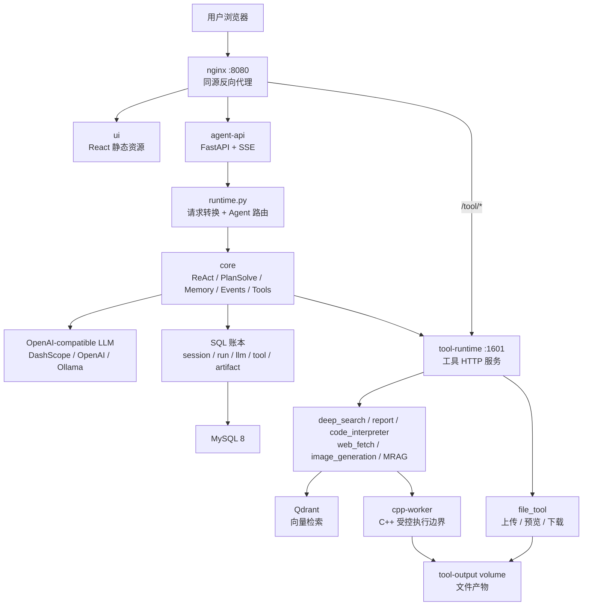
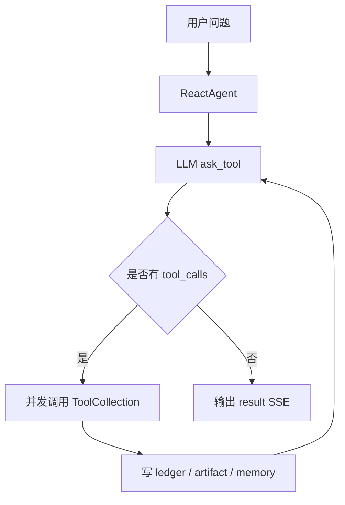
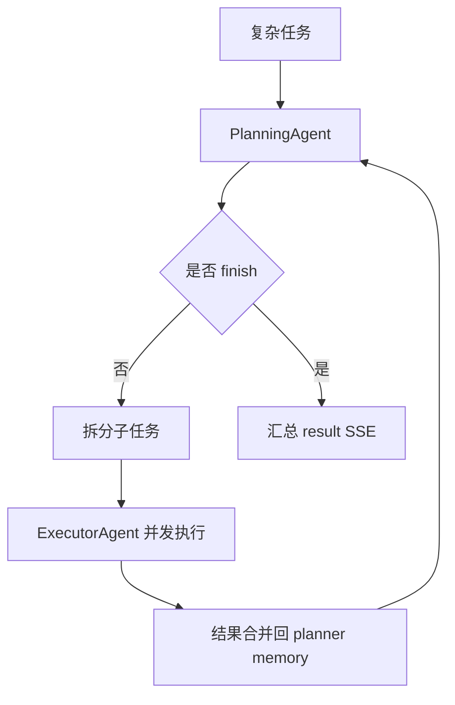

# MRZ's AI Agent

MRZ's AI Agent 是一套以 **Python + C++** 为主链路的 AI Agent 运行时。

它把对话编排、工具运行、文件产物、RAG/MRAG、前端工作台和单机部署收敛到一个可以验证、可以继续扩展的仓库里。主后端使用 FastAPI，工具运行时使用独立 HTTP 服务，底层命令执行由 C++ worker 约束边界。

## 模块一览

| 模块 | 路径 | 主要职责 |
| --- | --- | --- |
| `agent-api` | `services/agent-api` | FastAPI API、SSE、ReAct、PlanSolve、会话、SQL 账本、文件上传、图片生成转发 |
| `tool-runtime` | `reactor-tool` | 工具 HTTP 服务、deep search、report、code interpreter、web fetch、image generation、MRAG/RAG、文件服务 |
| `cpp-worker` | `services/cpp-worker` | JSON-over-stdin C++ worker，负责受控命令执行、超时、退出码、文件产物扫描和 sha256 |
| `ui` | `ui` | React + TypeScript 前端工作台 |
| `deploy` | `docker-compose.yml`、`deploy/nginx.conf` | MySQL、Qdrant、agent-api、tool-runtime、ui、nginx 单机编排 |

## 仓库结构

```text
.
├── README.md              # 项目入口
├── CHANGELOG.md           # 阶段变更
├── docs/                  # 架构、使用、部署、验证和项目说明
├── services/              # agent-api 与 cpp-worker
├── reactor-tool/          # 工具运行时
├── runtime/skills/        # 工具运行时可调用的技能素材
├── ui/                    # React 前端工作台
├── deploy/                # nginx 配置
└── docker-compose.yml     # 单机部署编排
```

更细的阅读顺序见 [仓库结构地图](docs/architecture/repository-map.md)。如果只想确认默认部署到底保留了什么、三种模式怎么跑，直接看 [完整主链路运行说明](docs/development/main-chain-runbook.md)。

## 核心能力

- **Agent 对话**：`/web/api/v1/gpt/queryAgentStreamIncr` 和 `/AutoAgent` 两个主入口。
- **ReAct**：短链路工具调用，支持工具观察写回 memory 并继续推理。
- **PlanSolve**：复杂任务先规划、再并发执行子任务、最后汇总结果。
- **SSE**：每帧输出 JSON `data:`，便于前端直接解析和展示。
- **工具调用**：通过 `tool-runtime` 承接搜索、报告、代码解释器、网页抓取、图片生成、MRAG/RAG 等能力。
- **文件产物**：工具产物写入 volume，通过文件服务预览和下载。
- **执行账本**：run、LLM invocation、tool invocation、artifact、session 可落库复盘。
- **执行边界**：C++ worker 限制工作目录、控制超时、回传退出码和本次命令新增或改动的文件。
- **部署闭环**：Docker Compose 启动 `mysql/qdrant/tool-runtime/agent-api/ui/nginx`。

## 架构



## Agent 模式

### ReAct



### PlanSolve



## 快速开始

### 1. 准备环境

需要 Docker Desktop 或 Docker Engine，并启用 Docker Compose v2。

```bash
docker info
```

### 2. 启动服务

默认不需要创建 `.env`。`docker-compose.yml` 已经内置 fake LLM、MySQL、Qdrant、tool-runtime、agent-api、ui 和 nginx 的本地默认值：

```bash
REACTOR_FAKE_LLM=true
```

这个模式不需要模型 Key，可以先验证 API、SSE、数据库、前端和三种主流程。deep search、图片生成、MRAG/RAG 等真实效果仍取决于对应外部模型、搜索、知识库和向量配置。

```bash
docker compose up --build
```

访问地址：

- UI：http://localhost:8080
- agent-api：http://localhost:8000/web/health
- tool-runtime：http://localhost:1601
- Qdrant：http://localhost:6333
- MySQL：localhost:3307（容器内仍为 3306）

如果宿主端口被占用，可以用 `.env` 覆盖 `NGINX_HOST_PORT`、`AGENT_API_HOST_PORT`、`TOOL_RUNTIME_HOST_PORT`、`QDRANT_HOST_PORT` 和 `MYSQL_HOST_PORT`。

`agent-api` 容器启动时默认执行：

```bash
alembic -c alembic.ini upgrade head
python scripts/seed.py
```

### 3. 可选：覆盖配置或使用真实模型

只有需要覆盖默认值时才复制环境模板；这不是启动前置步骤：

```bash
cp .env.example .env
```

使用真实模型时，在 `.env` 中修改：

```bash
REACTOR_FAKE_LLM=false
REACTOR_OPENAI_BASE_URL=https://dashscope.aliyuncs.com/compatible-mode/v1
REACTOR_OPENAI_API_KEY=你的Key
REACTOR_REACT_MODEL=qwen-plus
REACTOR_PLANNER_MODEL=qwen-plus
REACTOR_EXECUTOR_MODEL=qwen-plus
```

OpenAI、DashScope、Ollama 等 OpenAI-compatible 网关都可以接入。

## API 示例

### 健康检查

```bash
curl http://localhost:8000/web/health
```

### ReAct

```bash
curl -N \
  -H 'Content-Type: application/json' \
  -X POST http://localhost:8000/web/api/v1/gpt/queryAgentStreamIncr \
  -d '{
    "query": "请介绍一下这个系统",
    "sessionId": "session-react-001",
    "deepThink": 0
  }'
```

### PlanSolve

```bash
curl -N \
  -H 'Content-Type: application/json' \
  -X POST http://localhost:8000/web/api/v1/gpt/queryAgentStreamIncr \
  -d '{
    "query": "帮我规划一份报告生成流程",
    "sessionId": "session-plan-001",
    "deepThink": 1
  }'
```

### 文件上传

```bash
curl \
  -X POST http://localhost:8000/api/agent/file/upload \
  -F 'sessionId=session-file-001' \
  -F 'file=@README.md'
```

## 测试

agent-api：

```bash
uv run --project services/agent-api \
  python -W error::DeprecationWarning \
  -m unittest discover \
  -s services/agent-api/tests \
  -t services/agent-api \
  -v
```

tool-runtime：

```bash
cd reactor-tool
uv run python -m unittest discover -s tests -v
```

C++ worker：

```bash
python3 -m unittest discover -s services/cpp-worker/tests -v
```

C++ 编译检查：

```bash
g++ -std=c++17 -Wall -Wextra -Wpedantic \
  services/cpp-worker/src/main.cpp \
  -o /tmp/reactor_cpp_worker_verify
```

Docker Compose 配置检查：

```bash
docker compose config
docker compose config --services
```

## 当前边界

已覆盖主链路：Agent 对话、ReAct、PlanSolve、SSE、工具调用、文件产物、图片生成、MRAG/RAG、前端工作台和 Docker Compose 部署。

瘦身原则是清掉本地缓存、重复说明和非运行构建上下文，不裁剪默认主设计里的 MySQL、Qdrant、tool-runtime、runtime skills、MRAG、图片生成、DeepSearch 或复杂工作区 UI。完整口径见 [完整主链路运行说明](docs/development/main-chain-runbook.md)。

继续生产化时建议补齐：

- dataAgent/NL2SQL 深化。
- Admin DTO 强类型化。
- 正式鉴权和权限控制。
- tool-runtime 资源限制和沙箱策略。
- 全链路日志、指标、Tracing。

## 文档

- [docs/README.md](docs/README.md)：详细文档导航。
- [docs/development/main-chain-runbook.md](docs/development/main-chain-runbook.md)：完整主链路运行说明。
- [docs/architecture/repository-map.md](docs/architecture/repository-map.md)：仓库结构地图。
- [docs/architecture/overview.md](docs/architecture/overview.md)：Python+C++ 架构速览。
- [docs/architecture/design.md](docs/architecture/design.md)：模块设计、数据模型、SSE 协议和执行链路。
- [docs/development/usage.md](docs/development/usage.md)：运行、配置、接口调用和排障。
- [docs/development/testing.md](docs/development/testing.md)：验证清单。
- [docs/deployment/single-node-docker.md](docs/deployment/single-node-docker.md)：单机 Docker 部署。
- [docs/project/story.md](docs/project/story.md)：项目复盘和表达提纲。
- [docs/project/interview-notes.md](docs/project/interview-notes.md)：面试讲解提纲。
- [CHANGELOG.md](CHANGELOG.md)：按模块整理的阶段变更。
