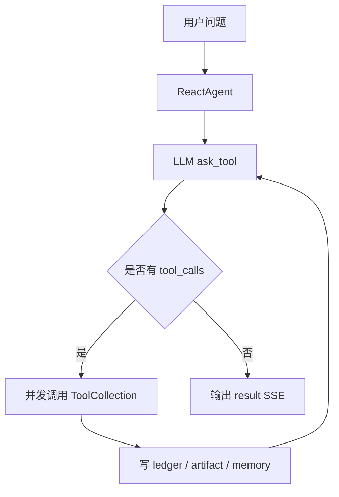

# MRZ's AI Agent

MRZ's AI Agent 是一套基于 **Python + C++** 的 AI Agent 后端运行时。

项目围绕现代 Agent 系统的核心链路搭建：`ReAct`、`PlanSolve`、工具调用、SSE 流式输出、执行账本、文件产物、React 前端工作台和 Docker 单机部署。主后端使用 FastAPI 实现，工具运行时通过 HTTP 解耦，底层受控执行由 C++ worker 承担。

当前仓库主线已经收敛为 Python + C++。旧 Java/Maven 后端源码已从工作树删除，迁移依据保留在 Git 历史和本文档的架构说明中。当前可运行主链路集中在：

- `services/agent-api`
- `services/cpp-worker`
- `reactor-tool`
- `ui`
- `docker-compose.yml`
- `deploy/nginx.conf`

## 项目概览

核心目标：

- 提供兼容前端的 Agent API 和 SSE 流式输出。
- 支持 `deepThink=0` 的 ReAct 模式。
- 支持 `deepThink=1` 的 PlanSolve 模式。
- 支持工具调用、工具结果回放和文件产物登记。
- 使用 SQLAlchemy + Alembic 管理数据库模型和版本。
- 使用 MySQL 持久化会话、run、LLM invocation、tool invocation 和 artifact。
- 使用 Qdrant 支撑向量检索类工具。
- 使用 C++ worker 处理受控命令执行、超时、stdout/stderr、退出码、文件扫描和 sha256。
- 使用 Docker Compose 启动 `nginx`、`ui`、`agent-api`、`tool-runtime`、`mysql`、`qdrant`。

## 核心能力

- **Agent 编排**：ReAct 主循环、PlanSolve 规划执行循环、最大步数终止和异常状态输出。
- **SSE 协议**：统一使用 JSON data，便于前端直接解析。
- **工具系统**：`reactor-tool` 提供 deep search、report、code interpreter、web fetch、image generation、MRAG 等工具。
- **执行账本**：记录 run、LLM 调用、工具调用、artifact 和会话摘要。
- **文件产物**：工具输出文件写入 Docker volume，并通过 HTTP 预览和下载。
- **受控执行**：C++ worker 提供进程执行边界，隔离低层执行细节。
- **单机部署**：Docker Compose 提供本地和服务器部署基础。

## 统一架构


## 运行时模块

| 模块 | 路径 | 作用 |
| --- | --- | --- |
| `agent-api` | `services/agent-api` | FastAPI API、SSE、Agent 编排、SQL 账本、前端兼容入口 |
| `cpp-worker` | `services/cpp-worker` | C++ JSON-over-stdin worker，负责受控执行和文件扫描 |
| `tool-runtime` | `reactor-tool` | deep search、report、code interpreter、file service、MRAG 等工具 |
| `ui` | `ui` | React 前端工作台 |
| `nginx` | `deploy/nginx.conf` | 同源代理前端、agent-api、tool-runtime |

## Agent 模式

### ReAct

适合短链路工具调用任务。



### PlanSolve

适合多步骤复杂任务。


## C++ Worker

C++ 不负责 Agent 智能逻辑，也不负责 HTTP、SSE、ORM 或 LLM。

它只承担工具运行层里的底层执行边界：

- 执行受控命令或脚本。
- 控制超时时间。
- 捕获退出码。
- 捕获 stdout/stderr。
- 扫描执行目录下的文件产物。
- 计算文件 sha256。
- 通过 `CPP_WORKER_ROOT` 限制执行目录。

## 快速开始

### 1. 准备环境

需要：

- Docker Desktop 或 Docker Engine
- Docker Compose v2

确认 Docker 已启动：

```bash
docker info
```

### 2. 配置环境变量

```bash
cp .env.example .env
```

默认使用 fake LLM：

```bash
REACTOR_FAKE_LLM=true
```

该模式可在没有模型 Key 的情况下验证 API、SSE、数据库、前端和工具链路。

### 3. 启动服务

```bash
docker compose up --build
```

访问地址：

- UI：http://localhost:8080
- agent-api：http://localhost:8000/web/health
- tool-runtime：http://localhost:1601
- Qdrant：http://localhost:6333
- MySQL：localhost:3306

`agent-api` 容器启动时默认执行：

```bash
alembic -c alembic.ini upgrade head
python scripts/seed.py
```

### 4. 使用真实模型

`.env` 中修改：

```bash
REACTOR_FAKE_LLM=false
REACTOR_OPENAI_BASE_URL=https://dashscope.aliyuncs.com/compatible-mode/v1
REACTOR_OPENAI_API_KEY=你的Key
REACTOR_REACT_MODEL=qwen-plus
REACTOR_PLANNER_MODEL=qwen-plus
REACTOR_EXECUTOR_MODEL=qwen-plus
```

OpenAI、DashScope、Ollama 等 OpenAI-compatible 网关都可以接入。

## API 示例

### 健康检查

```bash
curl http://localhost:8000/web/health
```

### ReAct

```bash
curl -N \
  -H 'Content-Type: application/json' \
  -X POST http://localhost:8000/web/api/v1/gpt/queryAgentStreamIncr \
  -d '{
    "query": "请介绍一下这个系统",
    "sessionId": "session-react-001",
    "deepThink": 0
  }'
```

### PlanSolve

```bash
curl -N \
  -H 'Content-Type: application/json' \
  -X POST http://localhost:8000/web/api/v1/gpt/queryAgentStreamIncr \
  -d '{
    "query": "帮我规划一份报告生成流程",
    "sessionId": "session-plan-001",
    "deepThink": 1
  }'
```

### 文件上传

```bash
curl \
  -X POST http://localhost:8000/api/agent/file/upload \
  -F 'sessionId=session-file-001' \
  -F 'file=@README.md'
```

## 测试

agent-api：

```bash
uv run --project services/agent-api \
  python -W error::DeprecationWarning \
  -m unittest discover \
  -s services/agent-api/tests \
  -t services/agent-api \
  -v
```

C++ worker：

```bash
python3 -m unittest discover -s services/cpp-worker/tests -v
```

tool-runtime：

```bash
cd reactor-tool
uv run python -m unittest discover -s tests -v
```

C++ 编译检查：

```bash
g++ -std=c++17 -Wall -Wextra -Wpedantic \
  services/cpp-worker/src/main.cpp \
  -o /tmp/reactor_cpp_worker_verify
```

Docker Compose 配置检查：

```bash
docker compose config
```

## 当前状态

已完成：

- Python FastAPI `agent-api`
- ReAct 主循环
- PlanSolve 规划/执行循环
- SSE JSON 事件
- OpenAI-compatible LLM adapter
- fake/demo LLM
- tool-runtime HTTP adapter
- SQLAlchemy 账本
- Alembic 数据库版本管理
- 前端兼容的 Admin 通用 CRUD 持久化入口
- 文件上传转发
- dataAgent SSE 前端兼容入口
- C++ worker
- Docker Compose 单机部署配置
- 旧 Java/Maven 后端源码移除，仓库主线收敛为 Python+C++

后续生产化方向：

- 强化 dataAgent/NL2SQL 能力。
- Admin DTO 强类型化。
- 正式鉴权和权限控制。
- 更完整的 tool-runtime 安全沙箱。
- 生产级日志、指标、Tracing。
- 完整 Docker build/up 环境验证。

## 部署与文档

- [USAGE.md](USAGE.md)：运行、配置、接口调用和排障。
- [DESIGN.md](DESIGN.md)：模块设计、数据模型、SSE 协议和执行链路。
- [deployment/single-node-docker.md](deployment/single-node-docker.md)：单机 Docker 部署。
- [architecture/python-cpp-rewrite.md](architecture/python-cpp-rewrite.md)：架构说明。
