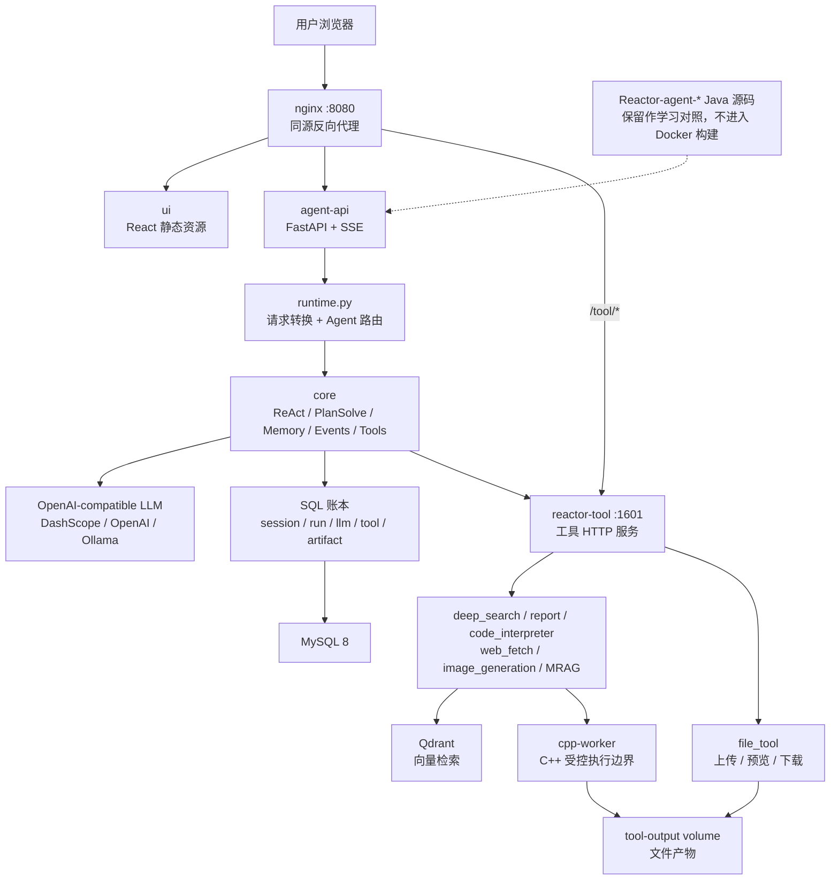
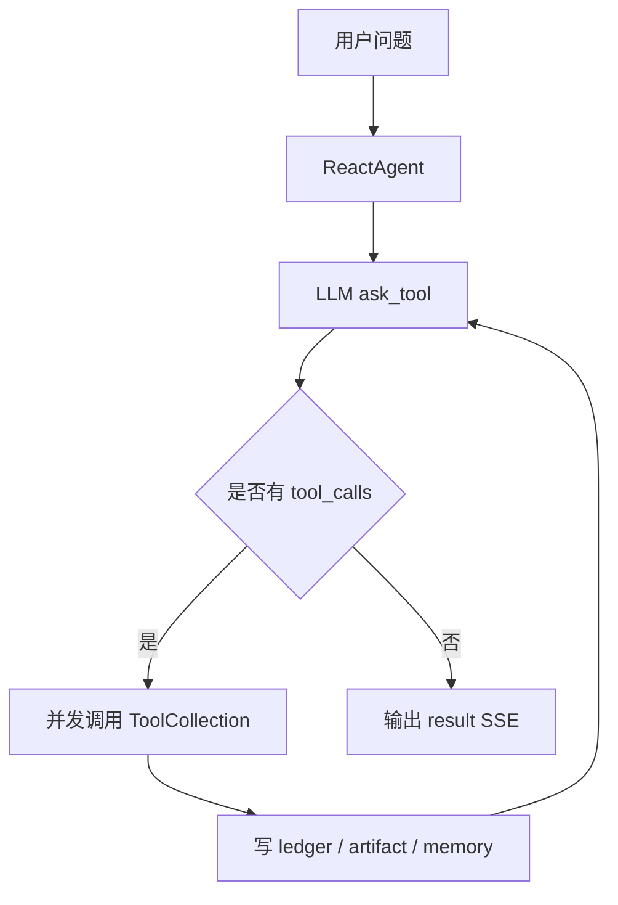
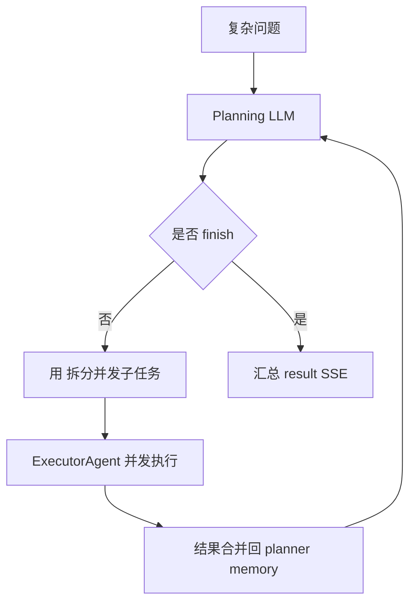

# AI Agent Python+C++ Runtime

一个从 Java 多智能体项目重构而来的 **Python + C++ Agent 后端实验/学习项目**。

这个版本保留原项目最有价值的业务思想：`ReAct`、`PlanSolve`、工具调用、SSE 流式输出、执行账本、文件产物和前端工作台；同时把主后端重建为更容易学习、调试和面试讲解的 Python 技术栈，并用 C++ 封装底层受控执行边界。

> 当前仓库仍保留 `Reactor-agent-*` Java 源码，作为学习对照和迁移来源；真正运行的重构版集中在 `services/agent-api`、`services/cpp-worker`、`reactor-tool`、`ui` 和 Docker Compose。

## 为什么重构

原始项目的业务设计很好，但对不熟悉 Java/Spring 的学习者来说，理解成本偏高。本重构版的目标是：

- 用 Python FastAPI 重建 Agent API、SSE、编排和持久化主链路。
- 用 `asyncio` 表达 ReAct 工具并发和 PlanSolve 子任务并发。
- 复用原有 `reactor-tool`，保留 deep search、report、code interpreter、web fetch、image generation、MRAG 等工具能力。
- 用 C++ worker 处理低层命令执行、超时、退出码、stdout/stderr、产物扫描和 sha256。
- 保留 React 前端，只做 API/SSE 兼容。
- 提供 Docker Compose 单机部署，方便本地学习和后续上线。

## 核心亮点

- **两种 Agent 模式**：`deepThink=0` 路由到 ReAct，`deepThink=1` 路由到 PlanSolve。
- **SSE 全 JSON 协议**：每一帧都是前端可直接 `JSON.parse` 的 JSON。
- **SQL 执行账本**：run、LLM invocation、tool invocation、artifact、session summary 全部落账。
- **工具运行时复用**：保留并整理 `reactor-tool`，Python Agent 通过 HTTP 调用工具服务。
- **C++ 执行边界**：低层脚本/命令执行不混入 Python 业务编排。
- **前端兼容**：保留现有 React UI，nginx 统一同源代理。
- **Docker 单机部署**：MySQL、Qdrant、agent-api、tool-runtime、ui、nginx 一套 compose 启动。
- **学习友好**：提供使用手册、设计文档、架构图和面试讲解材料。

## 统一架构



## 运行时模块

| 模块 | 路径 | 作用 |
| --- | --- | --- |
| `agent-api` | `services/agent-api` | FastAPI API、SSE、Agent 编排、SQL 账本、Admin 兼容 |
| `cpp-worker` | `services/cpp-worker` | C++ JSON-over-stdin worker，负责受控执行和文件扫描 |
| `tool-runtime` | `reactor-tool` | deep search、report、code interpreter、file service、MRAG 等工具 |
| `ui` | `ui` | React 前端工作台 |
| `nginx` | `deploy/nginx.conf` | 同源代理前端、agent-api、tool-runtime |
| `docs` | `USAGE.md`、`DESIGN.md`、`architecture/` | 使用说明、设计说明、面试材料 |
| `legacy Java` | `Reactor-agent-*` | 原 Java 源码，作为对照和迁移参考 |

## Agent 模式

### ReAct

适合短链路任务。



### PlanSolve

适合复杂任务。



## C++ 在项目中的角色

C++ 不负责 Agent 智能逻辑，也不负责 HTTP、SSE、ORM 或 LLM。

它只承担工具运行层里的底层执行边界：

- 执行受控命令或脚本。
- 控制超时时间。
- 捕获退出码。
- 捕获 stdout/stderr。
- 扫描执行目录下的文件产物。
- 计算文件 sha256。
- 通过 `CPP_WORKER_ROOT` 限制执行目录。

一句话概括：

> Python 负责 Agent 编排和业务协议，C++ 负责工具运行时里的受控执行边界。

## 快速开始

### 1. 准备环境

需要：

- Docker Desktop 或 Docker Engine
- Docker Compose v2

确认 Docker 已启动：

```bash
docker info
```

### 2. 配置环境变量

```bash
cp .env.example .env
```

默认使用 fake LLM：

```bash
REACTOR_FAKE_LLM=true
```

这可以在没有模型 Key 的情况下先跑通 API、SSE、数据库和前端。

### 3. 启动

```bash
docker compose up --build
```

访问：

- UI：http://localhost:8080
- agent-api：http://localhost:8000/web/health
- tool-runtime：http://localhost:1601
- Qdrant：http://localhost:6333
- MySQL：localhost:3306

`agent-api` 容器启动时会默认执行：

```bash
alembic -c alembic.ini upgrade head
python scripts/seed.py
```

### 4. 使用真实模型

`.env` 中修改：

```bash
REACTOR_FAKE_LLM=false
REACTOR_OPENAI_BASE_URL=https://dashscope.aliyuncs.com/compatible-mode/v1
REACTOR_OPENAI_API_KEY=你的Key
REACTOR_REACT_MODEL=qwen-plus
REACTOR_PLANNER_MODEL=qwen-plus
REACTOR_EXECUTOR_MODEL=qwen-plus
```

OpenAI、DashScope、Ollama 等 OpenAI-compatible 网关都可以接。

## API 示例

### 健康检查

```bash
curl http://localhost:8000/web/health
```

### ReAct

```bash
curl -N \
  -H 'Content-Type: application/json' \
  -X POST http://localhost:8000/web/api/v1/gpt/queryAgentStreamIncr \
  -d '{
    "query": "请介绍一下这个系统",
    "sessionId": "session-react-001",
    "deepThink": 0
  }'
```

### PlanSolve

```bash
curl -N \
  -H 'Content-Type: application/json' \
  -X POST http://localhost:8000/web/api/v1/gpt/queryAgentStreamIncr \
  -d '{
    "query": "帮我规划一份 Agent 学习路线",
    "sessionId": "session-plan-001",
    "deepThink": 1
  }'
```

### 文件上传

```bash
curl \
  -X POST http://localhost:8000/api/agent/file/upload \
  -F 'sessionId=session-file-001' \
  -F 'file=@README.md'
```

## 测试

agent-api：

```bash
uv run --project services/agent-api \
  python -W error::DeprecationWarning \
  -m unittest discover \
  -s services/agent-api/tests \
  -t services/agent-api \
  -v
```

C++ worker：

```bash
python3 -m unittest discover -s services/cpp-worker/tests -v
```

C++ 编译检查：

```bash
g++ -std=c++17 -Wall -Wextra -Wpedantic \
  services/cpp-worker/src/main.cpp \
  -o /tmp/reactor_cpp_worker_verify
```

Docker Compose 配置检查：

```bash
docker compose config
```

## 当前实现状态

已完成：

- Python FastAPI `agent-api`
- ReAct 主循环
- PlanSolve 规划/执行循环
- SSE JSON 事件
- OpenAI-compatible LLM adapter
- fake/demo LLM
- tool-runtime HTTP adapter
- SQLAlchemy 账本
- Alembic migration
- Admin 通用 CRUD 持久化
- 文件上传转发
- dataAgent SSE 兼容占位
- C++ worker
- Docker Compose 单机部署配置
- 项目瘦身和 Docker build context 瘦身

仍需继续生产化：

- 完整迁移 Java dataAgent/NL2SQL。
- Admin DTO 强类型化。
- 正式鉴权和权限控制。
- 更完整的 tool-runtime 安全沙箱。
- 生产级日志、指标、Tracing。
- 完整 Docker build/up 环境验证。

## 项目瘦身说明

当前仓库已经删除不参与运行的本地生成物和旧平台二进制：

- 删除 `services/agent-api/.venv`
- 删除 Python `__pycache__` 和 `*.pyc`
- 删除 `.DS_Store`、`.codegraph`
- 删除 `reactor-tool` 下 Windows-only 小红书 MCP `.exe`

`.dockerignore` 已排除：

- Java 旧模块
- assets/runtime 文档资产
- 虚拟环境和缓存
- `.exe`

因此 Java 源码保留在仓库中用于学习对照，但不进入 Docker 构建上下文。

## 文档

- [USAGE.md](USAGE.md)：完整使用手册。
- [DESIGN.md](DESIGN.md)：细粒度设计说明和统一架构图。
- [deployment/single-node-docker.md](deployment/single-node-docker.md)：单机 Docker 部署。
- [architecture/python-cpp-rewrite.md](architecture/python-cpp-rewrite.md)：架构速览。
- [architecture/interview-notes.md](architecture/interview-notes.md)：面试讲解稿和追问答案。

## 面试讲法

可以这样概括这个项目：

> 我把一个 Java 多智能体项目重构成 Python+C++ 技术栈：Python FastAPI 承担 API、SSE、ReAct、PlanSolve、SQL 账本和工具编排；原有 reactor-tool 继续提供搜索、报告、代码解释器、图片生成和 MRAG 等工具能力；C++ worker 只负责低层受控执行边界，例如超时、退出码、stdout/stderr、文件产物扫描和 sha256。这个设计保留了原项目的业务语义，又让架构更清晰、更容易部署和讲解。
