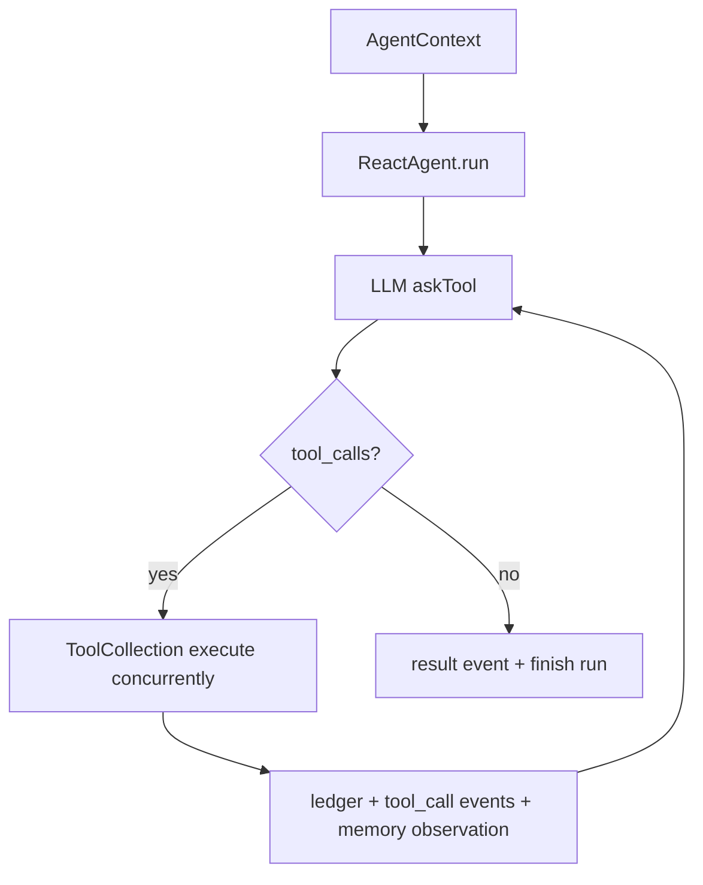
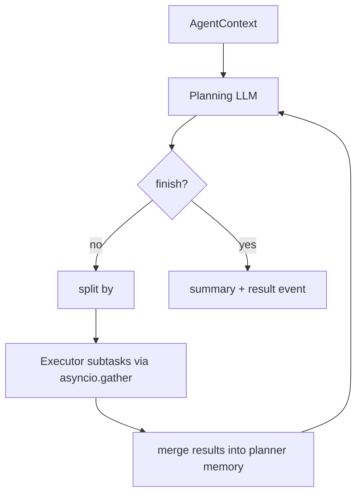

# Reactor Agent Python+C++ 重构架构说明

## 目标

这个重构版把历史 Java Spring Boot 后端的主链路职责重建为两个内聚服务：

- `agent-api`：Python FastAPI 服务，负责 HTTP/SSE、Agent 编排、会话、账本、管理接口兼容。
- `tool-runtime`：复用原有 `reactor-tool` Python 工具服务，负责 deep search、report、code interpreter、image generation、MRAG 等工具。

C++ 不负责 LLM、SSE、ORM 这些 Python 生态更成熟的部分，只负责低层边界能力，例如进程执行、超时控制、stdout/stderr 捕获、产物扫描和文件哈希。

## 历史职责到 Python/C++ 映射

旧 Java/Maven 后端源码已从当前工作树删除，以下表格记录的是迁移时的职责映射，便于理解为什么现在的 Python/C++ 模块能承接主链路能力。

| 历史职责 | 新位置 | 说明 |
| --- | --- | --- |
| HTTP Controller | `services/agent-api/agent_api/api` | FastAPI 路由承接前端 API 和 SSE |
| 应用编排 | `services/agent-api/agent_api/runtime.py` | 请求转换、策略路由、SSE 编排 |
| Agent 运行时 | `services/agent-api/agent_api/core` | ReAct、PlanSolve、Memory、ToolCollection |
| 持久化基础设施 | `services/agent-api/agent_api/storage` | SQLAlchemy 模型与 Alembic migration |
| 工具运行时 | `reactor-tool` | Python 工具服务承接 deep search、report、code interpreter、MRAG 等 |
| 工具并发 | `asyncio.gather` | 工具调用和 PlanSolve 子任务并发 |
| SSE 输出 | FastAPI `StreamingResponse` | 输出 `data: JSON` SSE |
| 执行账本 | `dialogue_*_ledger` 等表 | 保留 run、LLM、tool、artifact 事实 |

## 两个 Agent 模式

### ReAct

### PlanSolve

## 面试讲法

1. 先讲边界：Python 管编排，C++ 管低层执行，tool-runtime 管重工具。
2. 再讲可观测性：每次 run、LLM 调用、tool 调用、artifact 都落账，历史回放不靠日志。
3. 再讲稳定性：ReAct 适合短链路，PlanSolve 适合复杂任务；PlanSolve 子任务可并发，工具调用也可并发。
4. 最后讲迁移策略：不是逐行翻译旧后端，而是保留业务协议和核心运行时语义，用目标技术栈重建边界；旧源码可从 Git 历史追溯，当前工作树只保留 Python+C++ 主线。
