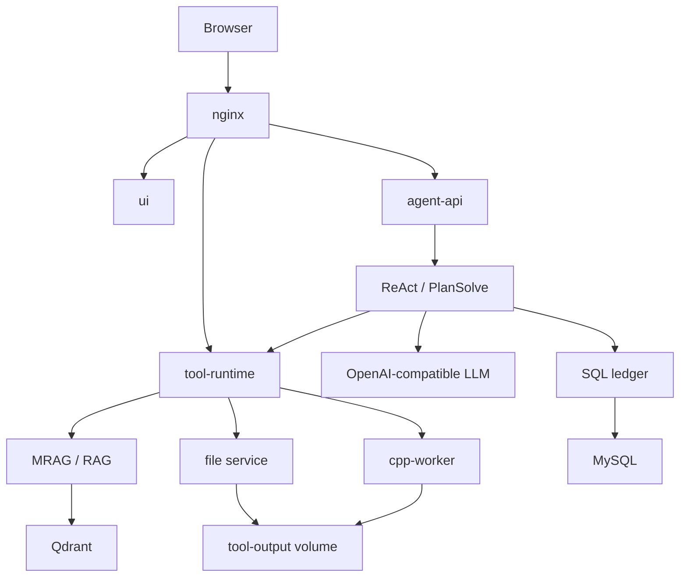
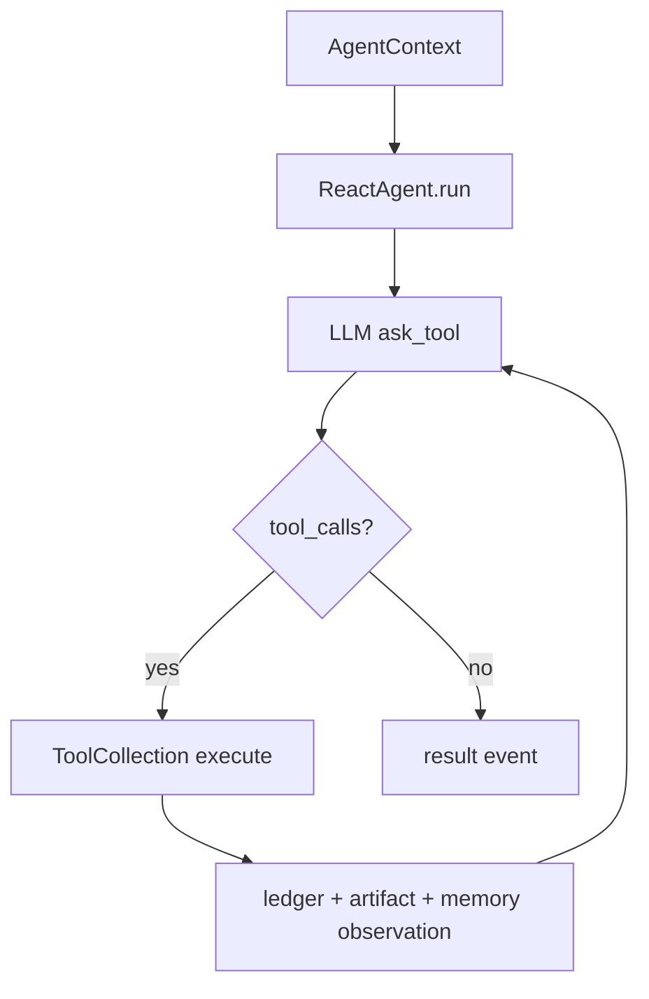
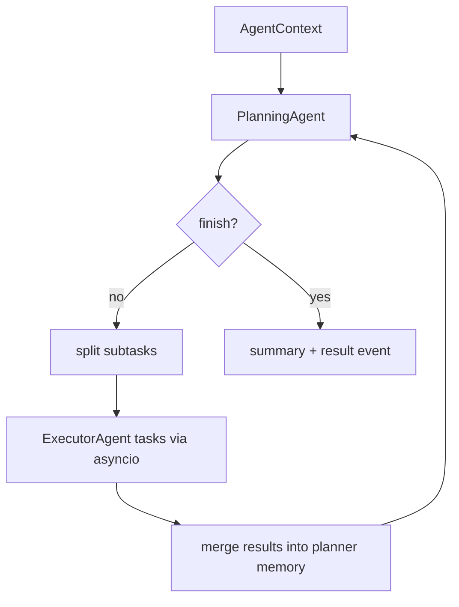

# Python+C++ 架构速览

## 目标

当前仓库的主线是一个 Python + C++ AI Agent 运行时：

- `agent-api`：Python FastAPI 服务，负责 HTTP/SSE、Agent 编排、会话、账本和前端兼容 API。
- `tool-runtime`：Python 工具服务，负责 deep search、report、code interpreter、web fetch、image generation、MRAG/RAG 和文件服务。
- `cpp-worker`：C++ JSON-over-stdin worker，负责进程执行、超时控制、退出码、stdout/stderr、产物扫描和文件哈希。
- `ui`：React + TypeScript 前端工作台。
- `deploy`：Docker Compose + nginx 单机部署。

C++ 不负责 LLM、SSE、ORM 或业务编排，只负责底层执行边界。

## 模块关系

## ReAct

ReAct 适合短链路工具任务。工具失败会被记录为 failed，并写回 observation，Agent 可以继续给出最终回复。

## PlanSolve

PlanSolve 适合报告、分析、规划等复杂任务。planner 负责任务拆解，executor 并发处理子任务，最后统一汇总。

## 账本

每次运行都围绕事实表记录：

- run：一次 Agent 请求。
- LLM invocation：一次模型调用。
- tool invocation：一次工具调用。
- artifact：文件、图片、报告等产物。
- session：会话聚合和历史查看。

这样排障不只靠日志，可以从结构化账本复盘一次回答的生成过程。

## 面试讲法

1. 先讲边界：`agent-api` 管编排，`tool-runtime` 管工具，`cpp-worker` 管低层执行。
2. 再讲两种 Agent：ReAct 做短链路工具循环，PlanSolve 做复杂任务拆解和并发执行。
3. 再讲可观测性：run、LLM、tool、artifact 都落账。
4. 再讲稳定性：SSE JSON 协议、工具失败记录、客户端断开取消后台任务、文件服务路径边界。
5. 最后讲部署：Docker Compose 集成 MySQL、Qdrant、tool-runtime、agent-api、ui、nginx。
