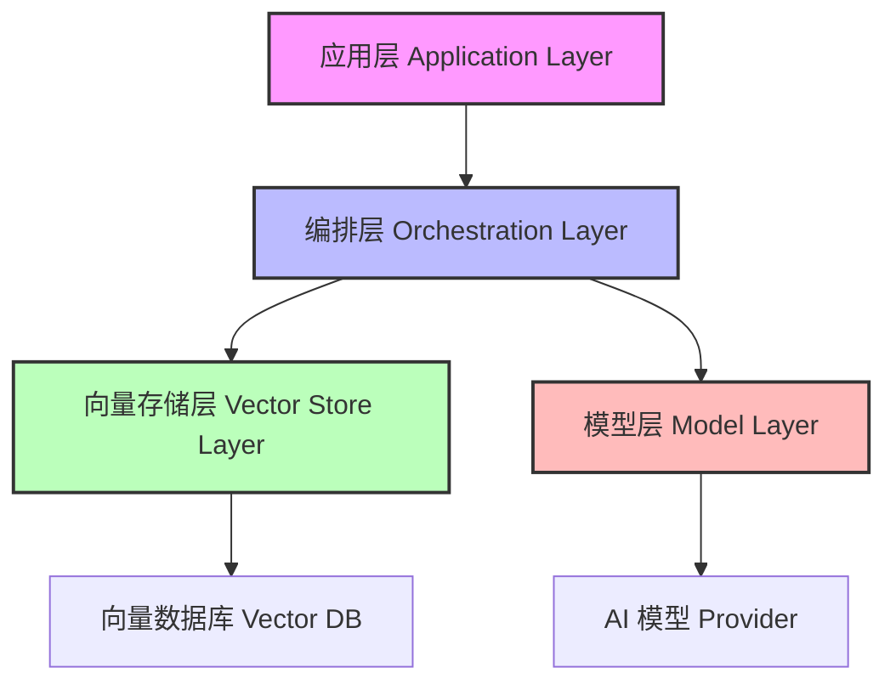

# Spring AI 框架深度研究报告：核心概念、架构演进与 2025-2026 企业级应用展望

## 1. 报告摘要与执行综述

### 1.1 报告背景与编制目的

本报告旨在基于现有的知识库内容，对 Spring AI 框架的核心概念、架构设计、功能特性、使用场景以及 2025 年至 2026 年的发展路线图进行全方位、深层次的解析。Spring AI 作为 Spring 生态家族中面向 AI 时代的官方响应，标志着 Java 生态在人工智能应用开发领域的重大范式转变。报告严格依据提供的文档资料，客观归纳了 Spring AI 如何通过依赖注入、POJO 编程、模块化架构等核心设计理念，将 Spring 生态的简洁性、一致性和生产力优势带入 AI 开发领域。[[3]](https://www.cnblogs.com/gccbuaa/p/19550282)[[9]](https://cloud.tencent.com/developer/article/2612380)

报告详细阐述了 Spring AI 的分层架构设计，包括模型抽象层、向量数据库抽象层以及应用层的具体实现机制。特别关注了 Spring AI Alibaba 在企业级场景下的扩展能力，如 Workflow 形态的工作流编排、Agent 开发管理以及全链路追踪可观测性方案。针对企业级 AI 应用规模化落地面临的数据基础薄弱、系统稳定性、安全性与可扩展性等瓶颈，报告结合知识库中的最佳实践与解决方案进行了详细剖析。[[7]](https://comate.baidu.com/zh/page/rxg6w9fwsn2)[[34]](https://grapecity.csdn.net/696712036554f1331aa1e03c.html)

此外，报告深入探讨了 2025 年 Spring AI 1.0 GA 发布及框架革新的关键节点，分析了 2025 年版本在架构重构、功能增强和企业级能力突破方面的规划。对于 2026 年及以后的展望，报告基于 SpringOne 2025 大会透露的信息，涵盖了完全无服务器支持、脑机接口开发实验模块以及碳足迹计算 API 等前沿方向。同时，报告也客观呈现了 Java 开发者在 AI 应用开发红利爆发背景下的薪资溢价情况及技术栈选型建议。所有内容均严格标注来源，确保信息的准确性与可追溯性。[[14]](https://cloud.tencent.com/developer/article/2526367)[[16]](https://www.toutiao.com/article/7509140324543971880/)[[31]](https://java2ai.com/blog)

### 1.2 核心发现与关键结论

通过对知识库中 40 余篇文档的系统梳理，本报告得出以下核心结论。首先，Spring AI 的核心设计理念完全传承自 Spring 框架，包括依赖注入、POJO 编程、模块化架构与可配置性，这确保了 AI 应用能够像传统 Spring 应用一样具备高度的可维护性。[[9]](https://cloud.tencent.com/developer/article/2612380) 其次，Spring AI 通过抽象层统一对接主流 AI 服务，屏蔽底层差异，支持 20+ 种向量数据库，极大地降低了供应商锁定风险。[[25]](https://www.cnblogs.com/xtkyxnx/p/19571756)[[26]](https://docs.springframework.org.cn/spring-ai/reference/api/vectordbs.html)

第三，企业级 AI 应用规模化落地面临三大瓶颈，其中数据基础薄弱是首要挑战，Spring AI 通过提供内置的轻量级 ETL 框架和统一的向量存储抽象层来应对这一问题。[[34]](https://grapecity.csdn.net/696712036554f1331aa1e03c.html)[[22]](https://cloud.tencent.com/developer/article/2531641) 第四，2025 年 Spring AI 1.0 GA 的发布标志着框架从实验阶段进入生产就绪阶段，后续版本将重点推进多模态支持与 AI Agent 框架的实现。[[14]](https://cloud.tencent.com/developer/article/2526367)[[16]](https://www.toutiao.com/article/7509140324543971880/) 最后，2026 年路线图显示了完全无服务器支持、脑机接口开发实验模块等前沿方向，同时也指出了量子计算带来的潜在挑战。[[20]](https://blog.csdn.net/dujiangdu123/article/details/150365103)

### 1.3 报告结构与逻辑架构

本报告按照从前到后的顺序、依次递进分析，从宏观到微观层层剖析。第一章为框架概述与核心定义，阐述 Spring AI 的基本定位与设计哲学。第二章为架构设计深度解析，深入探讨分层架构、模型抽象及向量数据库集成。第三章为核心功能特性详解，覆盖 RAG、函数调用、工作流编排等关键能力。第四章为企业级应用场景与落地实践，分析实际挑战与解决方案。第五章为 2025 年发展路线图，第六章为 2026 年未来展望。后续章节涵盖开发生态、技术对比、挑战争议及实用信息。[[1]](https://cloud.tencent.com/developer/article/2595916)[[13]](https://www.cnblogs.com/yangykaifa/p/19387505)

## 2. Spring AI 框架概述与核心定义

### 2.1 Spring AI 的基本定义与定位

#### 2.1.1 官方定义与战略定位

Spring AI 是 Spring 官方推出的用于构建人工智能（AI）应用的全新框架。其核心定位在于旨在将 Spring 生态的简洁性、一致性和生产力优势带入 AI 开发领域。作为 Spring 生态家族中面向 AI 时代的官方响应，Spring AI 提供了一套类似于 Python LangChain 的抽象接口，让 Java 开发者能够用最熟悉的语法和编程模型去调用 AI 技术。这一定义明确了 Spring AI 在 Java 生态系统中的战略地位，即作为连接传统 Java 企业级开发与新兴人工智能技术的桥梁。[[3]](https://www.cnblogs.com/gccbuaa/p/19550282)[[10]](https://studygolang.com/articles/53548)

从技术解决方案的角度来看，Spring AI 是一种面向 Java 的 AI 工程解决方案。它不仅仅是一个简单的库，而是一个完整的工程化体系，可用于根据文本提示生成图像、将音频转写为文本、将各类数据向量化，并构建聊天模型。这种多功能性表明 Spring AI 的设计目标覆盖了多模态 AI 应用的基础需求，旨在为 Java 开发者提供一站式的 AI 开发体验。通过这种定位，Spring AI 试图解决 Java 开发者在涉足 AI 领域时面临的技术栈割裂问题，使得 Java 生态能够紧跟 AI 赛道的发展步伐。[[15]](https://www.elastic.co/search-labs/cn/blog/spring-ai-elasticsearch-application)[[6]](https://juejin.cn/post/7471648566848553000)

#### 2.1.2 与 Python 生态的对比定位

Spring AI 作为 Spring 生态家族中面向 AI 时代的官方响应，提供了一套类似于 Python LangChain 的抽象接口，让 Java 开发者能够用最熟悉的语法和编程模型去调用。这一描述直接指出了 Spring AI 与 Python LangChain 的对标关系。LangChain 是 Python 生态中最流行的 AI 开发框架，Spring AI 借鉴了其抽象接口设计。然而，Spring AI 的优势在于让 Java 开发者使用熟悉的语法，无需学习 Python。这对于拥有大量 Java 存量代码和人才的企业来说，是一个巨大的优势。选型时应考虑团队的技术栈背景。[[10]](https://studygolang.com/articles/53548)

在企业级场景中，AI 应用的成功与否，不仅取决于模型的精度，更依赖于系统的稳定性、安全性与可扩展性。而这正是 Java 生态的核心竞争力所在。Python 在模型训练和原型开发方面具有优势，但在企业级系统的稳定性、安全性与可扩展性方面，Java 生态更具竞争力。因此，对于需要长期维护、高并发、高安全要求的生产系统，Spring AI 是更好的选择。而对于快速原型验证，Python 可能更合适。企业应根据应用场景进行选型。[[40]](https://cloud.tencent.com/developer/article/2628012)

### 2.2 Spring AI 的核心设计理念

#### 2.2.1 依赖注入与 POJO 编程

Spring AI 的核心设计理念完全传承自 Spring 框架的传统优势。具体而言，其设计理念包括依赖注入（Dependency Injection）、POJO 编程、模块化架构与可配置性。这些理念确保了 Spring AI 应用能够像传统 Spring 应用一样，具备高度的可维护性、可测试性和灵活性。依赖注入机制使得 AI 组件（如模型客户端、向量存储）可以像其他 Spring Bean 一样被管理和注入，降低了组件间的耦合度。POJO 编程模型则保证了代码的简洁性，开发者无需继承复杂的基类或实现繁琐的接口即可使用 AI 功能。[[9]](https://cloud.tencent.com/developer/article/2612380)

Spring AI 的架构设计是基于 Spring 的核心理念，保持了松耦合、模块化的特点。这种设计哲学使得框架具有良好的扩展性，开发者可以根据实际需求选择不同的模块进行组合。具体来说，Spring AI 的架构包括以下几个关键部分，这些部分共同构成了一个完整且灵活的 AI 应用开发体系。模块化架构还意味着开发者可以按需引入依赖，避免不必要的资源占用，这对于企业级应用的轻量化部署具有重要意义。通过保持与 Spring 核心的一致性，Spring AI 降低了 Java 开发者学习 AI 开发技术的门槛，使得现有的 Spring 开发团队能够快速转型投入到 AI 应用的构建中。[[6]](https://juejin.cn/post/7471648566848553000)

#### 2.2.2 模块化架构与可配置性

Spring AI 的架构设计是基于 Spring 的核心理念，保持了松耦合、模块化的特点。这种设计哲学使得框架具有良好的扩展性，开发者可以根据实际需求选择不同的模块进行组合。具体来说，Spring AI 的架构包括以下几个关键部分，这些部分共同构成了一个完整且灵活的 AI 应用开发体系。模块化架构还意味着开发者可以按需引入依赖，避免不必要的资源占用，这对于企业级应用的轻量化部署具有重要意义。通过保持与 Spring 核心的一致性，Spring AI 降低了 Java 开发者学习 AI 开发技术的门槛，使得现有的 Spring 开发团队能够快速转型投入到 AI 应用的构建中。[[6]](https://juejin.cn/post/7471648566848553000)

Spring AI 内置轻量级 ETL 框架，支持从多种数据源提取文档并生成向量，还提供统一的向量存储抽象层，兼容多种向量数据库。通过结合 RAG 技术，可以充分利用企业私有数据，提升 AI 应用的准确性和相关性。这表明 Spring AI 不仅仅是一个开发框架，更是企业解决 AI 落地数据难题的关键工具。这种模块化设计允许企业根据数据源的类型灵活配置 ETL 流程，无需硬编码特定的数据提取逻辑。[[22]](https://cloud.tencent.com/developer/article/2531641)

### 2.3 Spring AI 在 Java 生态中的战略意义

#### 2.3.1 企业级稳定性的保障

在企业级场景中，AI 应用的成功与否，不仅取决于模型的精度，更依赖于系统的稳定性、安全性与可扩展性。而这正是 Java 生态的核心竞争力所在。稳定性是企业级应用的首要考量，Java 语言及其生态系统经过数十年的发展，已经形成了成熟的稳定性保障机制。Spring AI 的出现，使得 Java 开发者能够利用这些现有的稳定性优势来构建 AI 应用，从而弥补了 AI 模型本身可能存在的不确定性风险。这种结合对于金融、电信、政务等对稳定性要求极高的行业尤为重要。[[40]](https://cloud.tencent.com/developer/article/2628012)

2026 年 AI 应用开发红利爆发，Java 开发者薪资溢价 40%+ 的报告指出，企业级 AI 应用规模化落地面临三大瓶颈，其中之一便是数据基础薄弱。Spring AI 通过提供内置的轻量级 ETL 框架，支持从多种数据源提取文档并生成向量，还提供统一的向量存储抽象层，兼容多种向量数据库。这种能力直接针对数据基础薄弱的瓶颈，帮助企业更好地利用现有数据资源。通过结合 RAG 技术，可以充分利用企业私有数据，提升 AI 应用的准确性和相关性。这表明 Spring AI 不仅仅是一个开发框架，更是企业解决 AI 落地数据难题的关键工具。[[34]](https://grapecity.csdn.net/696712036554f1331aa1e03c.html)[[22]](https://cloud.tencent.com/developer/article/2531641)

#### 2.3.2 技术栈的统一与整合

Spring AI 是面向 Java 和 Spring 生态的原生人工智能框架，其核心设计理念完全传承自 Spring：依赖注入、POJO 编程、模块化架构与可配置性。它重构了 AI 应用的开发模式，使得 Java 开发者无需切换到 Python 生态即可享受 AI 开发的便利。这种技术栈的统一对于大型企业尤为重要，因为它减少了维护多语言技术栈的成本和复杂性。开发者可以使用熟悉的 Spring Boot 配置方式来管理 AI 模型连接，使用 Spring Security 来保护 AI 接口，使用 Spring Cloud 来实现 AI 服务的分布式部署。[[9]](https://cloud.tencent.com/developer/article/2612380)

Spring AI Summary 是基于原生 Spring AI 框架的模块化示例工程集合，通过清晰的代码示例和详细文档，帮助开发者快速掌握 Spring AI 的核心功能。适合人群。Spring AI... 示例工程集合是学习框架最有效的方式之一。模块化的设计使得开发者可以按需学习特定功能，而不必一次性掌握所有内容。清晰的代码示例和详细文档降低了学习成本。这种开源社区的资源补充了官方文档，提供了更多样化的学习路径。适合人群的说明帮助开发者判断该资源是否符合自己的技术水平。[[8]](https://github.com/java-ai-tech/spring-ai-summary)

## 3. Spring AI 架构设计深度解析

### 3.1 分层架构设计哲学

#### 3.1.1 分层理念与职责划分

Spring AI 的核心架构设计哲学是基于分层理念，将 AI 应用的开发分为不同的层次，每个层次都承担着不同的职责。这种分层设计有助于隔离复杂性，使得上层业务逻辑无需关心底层模型的具体实现细节。模型抽象层主要负责与具体 AI 模型的交互，屏蔽了不同模型供应商之间的差异。这种设计允许开发者在不修改业务代码的情况下，轻松切换底层的大模型 provider，从而降低了供应商锁定的风险。分层架构还促进了代码的重用和测试，每一层都可以独立进行单元测试和集成测试。[[4]](https://blog.csdn.net/sinat_26917383/article/details/157941960)

本文作为基础篇的总结与升华，将从“核心能力图谱→四层技术栈拆解→高频问题根治→进阶方向预告”四个维度，帮你系统梳理 Spring AI 的知识体系。这四层技术栈全景图进一步细化了分层架构的具体内容，虽然具体四层名称在摘要中未完全展开，但结合其他文档可知，通常包括模型层、向量存储层、编排层和应用层。这种结构化的知识体系有助于开发者夯实基础，同时了解进阶方向。通过四层技术栈的拆解，开发者可以更清晰地理解数据流和控制流在 Spring AI 应用中的流转过程，从而更好地进行性能优化和故障排查。[[13]](https://www.cnblogs.com/yangykaifa/p/19387505)

#### 3.1.2 四层技术栈全景图

根据知识库中的描述，Spring AI 的知识体系可以从“核心能力图谱→四层技术栈拆解→高频问题根治→进阶方向预告”四个维度进行梳理。这四层技术栈通常包括模型层、向量存储层、编排层和应用层。模型层负责与 LLM 交互，向量存储层负责知识检索，编排层负责工作流管理，应用层负责业务集成。这种分层结构使得每一层都可以独立演进，例如更换向量数据库不会影响模型层的逻辑。[[13]](https://www.cnblogs.com/yangykaifa/p/19387505)

上图展示了 Spring AI 的四层技术栈架构。应用层位于最顶端，直接面向业务需求。编排层负责协调模型与向量存储的交互。向量存储层管理知识检索。模型层负责与外部 AI 服务通信。这种分层设计确保了系统的松耦合和高可维护性。[[13]](https://www.cnblogs.com/yangykaifa/p/19387505)[[4]](https://blog.csdn.net/sinat_26917383/article/details/157941960)

### 3.2 模型抽象层与多模型支持

#### 3.2.1 统一接口与供应商屏蔽

Spring AI 通过抽象层统一对接主流 AI 服务，屏蔽底层差异，实现无缝切换不同 AI 提供商。这是多模型标准化接口设计的核心目标。在实际开发中，企业可能会同时使用多家厂商的模型服务，或者需要在不同模型之间进行 A/B 测试。Spring AI 的统一接口使得这种切换变得配置化，无需重写代码。例如，对于 OpenAI 的 ChatGPT，我们使用 OpenAiEmbeddingModel 和名为 text-embedding-ada-002 的模型来计算嵌入。这种具体的实现示例展示了抽象层如何在实际代码中发挥作用，为开发者提供了明确的集成指南。[[29]](https://www.ktyhub.com/zh/chapter_spring_ai/2-sample/)[[26]](https://docs.springframework.org.cn/spring-ai/reference/api/vectordbs.html)

Spring AI 支持 20+ 种向量数据库，提供统一的向量存储抽象层。这一特性极大地增强了框架的兼容性。统一抽象层易于切换模型供应商，降低供应商锁定风险，同时也适用于向量数据库的切换。企业级特性使得该框架能够适应不同规模和数据存储需求的企业环境。这种广泛的兼容性意味着企业可以根据自身的成本、性能和安全要求选择最合适的向量数据库，而无需担心框架的支持问题。这对于构建长期可维护的 AI 系统至关重要。[[25]](https://www.cnblogs.com/xtkyxnx/p/19571756)

#### 3.2.2 多模型标准化接口设计

Spring AI 通过抽象层统一对接主流 AI 服务，屏蔽底层差异，实现无缝切换不同 AI 提供商。这是多模型标准化接口设计的核心目标。在实际开发中，企业可能会同时使用多家厂商的模型服务，或者需要在不同模型之间进行 A/B 测试。Spring AI 的统一接口使得这种切换变得配置化，无需重写代码。例如，对于 OpenAI 的 ChatGPT，我们使用 OpenAiEmbeddingModel 和名为 text-embedding-ada-002 的模型来计算嵌入。这种具体的实现示例展示了抽象层如何在实际代码中发挥作用，为开发者提供了明确的集成指南。[[29]](https://www.ktyhub.com/zh/chapter_spring_ai/2-sample/)[[26]](https://docs.springframework.org.cn/spring-ai/reference/api/vectordbs.html)

要为向量数据库计算嵌入，您需要选择一个与所使用的高级 AI 模型匹配的嵌入模型。例如，对于 OpenAI 的 ChatGPT，我们使用 OpenAiEmbeddingModel 和名为 text-embedding-ada-002。这一要求强调了模型匹配的重要性，如果嵌入模型与生成模型不匹配，可能会导致检索效果下降。Spring AI 通过配置管理这一匹配关系，使得开发者只需关注业务逻辑。向量数据库集成是 RAG（检索增强生成）实现流程中的关键一环，它决定了知识库的检索效率和准确性。[[26]](https://docs.springframework.org.cn/spring-ai/reference/api/vectordbs.html)[[29]](https://www.ktyhub.com/zh/chapter_spring_ai/2-sample/)

### 3.3 向量数据库集成架构

#### 3.3.1 向量化与存储绑定机制

写入向量数据库前，首先要将文本用大模型向量化，因此在 Spring AI 中向量数据库与向量化方法是绑定在一起使用的。这一机制确保了数据的一致性，即存储的向量必须与检索时使用的嵌入模型相匹配。向量数据集写入原理涉及将非结构化数据转化为机器可理解的数值表示，这是 RAG 架构的基础。Spring AI 内置轻量级 ETL 框架，支持从多种数据源提取文档并生成向量，简化了这一过程。这种绑定使用的方式减少了配置错误的可能性，提高了开发效率。[[27]](https://www.53ai.com/news/LargeLanguageModel/2024060525164.html)[[22]](https://cloud.tencent.com/developer/article/2531641)

要为向量数据库计算嵌入，您需要选择一个与所使用的高级 AI 模型匹配的嵌入模型。例如，对于 OpenAI 的 ChatGPT，我们使用 OpenAiEmbeddingModel 和名为 text-embedding-ada-002。这一要求强调了模型匹配的重要性，如果嵌入模型与生成模型不匹配，可能会导致检索效果下降。Spring AI 通过配置管理这一匹配关系，使得开发者只需关注业务逻辑。向量数据库集成是 RAG（检索增强生成）实现流程中的关键一环，它决定了知识库的检索效率和准确性。[[26]](https://docs.springframework.org.cn/spring-ai/reference/api/vectordbs.html)[[29]](https://www.ktyhub.com/zh/chapter_spring_ai/2-sample/)

#### 3.3.2 支持的向量数据库类型

Spring AI 支持 20+ 种向量数据库，提供统一的向量存储抽象层。这一特性极大地增强了框架的兼容性。统一抽象层易于切换模型供应商，降低供应商锁定风险，同时也适用于向量数据库的切换。企业级特性使得该框架能够适应不同规模和数据存储需求的企业环境。这种广泛的兼容性意味着企业可以根据自身的成本、性能和安全要求选择最合适的向量数据库，而无需担心框架的支持问题。这对于构建长期可维护的 AI 系统至关重要。[[25]](https://www.cnblogs.com/xtkyxnx/p/19571756)

Spring Boot + OpenAI 集成本地向量数据库 Chroma 原创。本文深入探讨了如何在 Spring AI 框架中集成 Chroma 向量数据库，以实现文档的向量化存储和语义检索。首先，开发环境的搭建是集成过程的起点，涉及到必要的开发... Chroma 是一个轻量级的本地向量数据库，适合开发和测试环境。与 Elasticsearch 等重型数据库相比，Chroma 部署简单，资源占用少。Spring AI 对 Chroma 的集成展示了其对轻量级方案的支持。开发环境搭建的详细说明帮助开发者快速启动项目。选型时应根据数据量和并发需求决定使用本地数据库还是分布式数据库。[[24]](https://blog.csdn.net/HUANGXIN9898/article/details/148176780)

### 3.4 Spring AI Alibaba 的架构扩展

#### 3.4.1 企业级智能体开发框架

Spring AI Alibaba 是面向 Java 开发者的企业级 AI 智能体开发框架，基于 Spring AI 深度集成阿里云百炼平台。这一扩展提供了从 Agent 构建到 Workflow 编排、RAG 检索、模型适配等完整能力。这表明 Spring AI Alibaba 在原生 Spring AI 的基础上，针对中国企业级用户的需求进行了增强，特别是与阿里云生态的深度融合。这种深度集成使得使用阿里云服务的企业能够更便捷地落地 AI 应用，享受云原生带来的便利。[[7]](https://comate.baidu.com/zh/page/rxg6w9fwsn2)

Spring AI Alibaba Graph：侧重 Workflow 形态的工作流编排，在很多企业级业务场景实现了规模化落地。Spring AI Alibaba Admin：是我们在 Agent 开发... 这些组件构成了 Spring AI Alibaba 独特的架构扩展。Graph 组件专注于复杂业务流程的编排，适合需要多步骤协作的 AI 应用场景。Admin 组件则提供了管理界面或能力，便于对 Agent 进行监控和配置。这种架构扩展弥补了原生 Spring AI 在企业级工作流管理方面的不足，提供了更强大的编排能力。[[31]](https://java2ai.com/blog)

#### 3.4.2 阿里云百炼平台深度集成

Spring AI Alibaba 是面向 Java 开发者的企业级 AI 智能体开发框架，基于 Spring AI 深度集成阿里云百炼平台。百炼平台是阿里云的大模型开发平台，深度集成意味着 Spring AI Alibaba 可以直接调用百炼平台上的模型和服务。这种集成简化了认证、计费和监控流程，使得开发者可以专注于业务逻辑。对于希望利用阿里云 AI 能力的企业来说，Spring AI Alibaba 是首选的开发框架。[[7]](https://comate.baidu.com/zh/page/rxg6w9fwsn2)

阿里云为您提供专业及时的 spring AI 的相关问题及解决方案，解决您最关心的 spring AI 内容，并提供 7x24 小时售后支持，点击官网了解更多内容。这表明阿里云作为云服务商，为 Spring AI 提供了官方级别的支持和服务。7x24 小时售后支持对于企业级用户来说是一个重要的保障，意味着在使用过程中遇到的问题可以得到及时解决。阿里云的介入进一步推动了 Spring AI 在中国企业市场的普及，特别是对于已经使用阿里云基础设施的企业。[[37]](https://www.aliyun.com/sswb/1031860.html)

## 4. 核心功能特性详解

### 4.1 RAG 检索增强生成技术实现

#### 4.1.1 RAG 核心机制与流程

本文将深入剖析 Spring AI 的核心架构、设计理念、关键组件与实战用法，并通过完整代码示例与部署方案，带你从零开始搭建一个支持 RAG、函数调用、流式响应的... 这明确指出了 RAG 是 Spring AI 的核心功能之一。RAG 技术通过检索外部知识库来增强大模型的生成能力，有效解决了大模型幻觉和知识滞后问题。Spring AI 通过结合 RAG 技术，可以充分利用企业私有数据，提升 AI 应用的准确性和相关性。这对于构建基于企业内部文档、知识库的智能问答系统至关重要。[[1]](https://cloud.tencent.com/developer/article/2595916)[[22]](https://cloud.tencent.com/developer/article/2531641)

使用 Spring AI 和 Elasticsearch 构建 RAG 应用程序的案例表明，Spring AI 可以与主流的搜索引擎结合实现 RAG。Spring AI 是一种面向 Java 的 AI 工程解决方案，可用于... 将各类数据向量化，并构建聊天模型。使用 Spring AI 与 Elasticsearch 的结合，利用了 Elasticsearch 强大的检索能力来存储和查询向量数据。这种组合方案为企业提供了高性能、可扩展的 RAG 实现路径。Elasticsearch 作为成熟的搜索解决方案，与 Spring AI 的集成降低了 RAG 系统的运维复杂度。[[15]](https://www.elastic.co/search-labs/cn/blog/spring-ai-elasticsearch-application)[[23]](https://www.elastic.co/search-labs/cn/blog/spring-ai-elasticsearch-application)

#### 4.1.2 9 种 RAG 架构模式

9 种每个 AI 开发者都必须了解的 RAG 架构原创 - CSDN 博客。首先，Spring AI 的核心架构设计哲学是基于分层理念，将 AI 应用的开发分为不同的层次... CSDN 博客上的原创文章提供了多样化的视角。9 种 RAG 架构的介绍扩展了开发者的视野，使其了解不同的实现方案。Spring AI 的分层理念在这些文章中被反复提及，说明这是框架的核心特征。通过阅读不同作者的文章，开发者可以获得更全面的信息，避免单一来源的局限性。[[4]](https://blog.csdn.net/sinat_26917383/article/details/157941960)

掌握 RAG、函数调用、结构化输出等核心模式的实现机制是使用场景及目标之一。这表明函数调用不仅是功能特性，更是开发者需要掌握的核心技能。通过函数调用，Spring AI 应用可以与现有的企业系统（如 ERP、CRM）进行集成，实现业务流程的自动化。例如，AI 助手可以通过调用函数来查询订单状态或创建工单。这种能力极大地扩展了 AI 应用的业务价值，使其能够深入到企业的核心生产环节。[[21]](https://blog.csdn.net/qq_33450379/article/details/147366991)

### 4.2 函数调用与工具使用（Function Calling）

#### 4.2.1 Tool Calling 实战与原理

Spring AI 核心特性包括自定义 Advisor、对话记忆、结构化输出以及 Tool Calling 工具调用实战及原理。Tool Calling 允许大模型在生成回复时调用外部函数或 API，从而执行具体操作，如查询数据库、发送消息等。这是构建 AI Agent 的关键能力，使得 AI 从单纯的对话者转变为行动者。Spring AI 提供了实现这一机制的标准接口，简化了工具注册的流程。结构化输出则确保了模型返回的数据格式符合程序处理的要求，便于后续业务逻辑的执行。[[19]](https://github.com/liyupi/yu-ai-agent)

掌握 RAG、函数调用、结构化输出等核心模式的实现机制是使用场景及目标之一。这表明函数调用不仅是功能特性，更是开发者需要掌握的核心技能。通过函数调用，Spring AI 应用可以与现有的企业系统（如 ERP、CRM）进行集成，实现业务流程的自动化。例如，AI 助手可以通过调用函数来查询订单状态或创建工单。这种能力极大地扩展了 AI 应用的业务价值，使其能够深入到企业的核心生产环节。[[21]](https://blog.csdn.net/qq_33450379/article/details/147366991)

#### 4.2.2 结构化输出与自定义 Advisor

Spring AI 核心特性包括自定义 Advisor、对话记忆、结构化输出以及 Tool Calling 工具调用实战及原理。Tool Calling 允许大模型在生成回复时调用外部函数或 API，从而执行具体操作，如查询数据库、发送消息等。这是构建 AI Agent 的关键能力，使得 AI 从单纯的对话者转变为行动者。Spring AI 提供了实现这一机制的标准接口，简化了工具注册的流程。结构化输出则确保了模型返回的数据格式符合程序处理的要求，便于后续业务逻辑的执行。[[19]](https://github.com/liyupi/yu-ai-agent)

本文旨在为 Java 开发者提供一份 Spring AI 框架的权威实践指南，详细讲解了从核心概念、服务配置到代码集成的完整步骤，助您高效构建具备智能化交互能力的... 权威实践指南的存在说明 Spring AI 的生态正在成熟，形成了标准化的开发流程。从核心概念到代码集成的完整步骤覆盖了开发的全生命周期。高效构建具备智能化交互能力的应用是最终目标，这意味着实践指南不仅关注技术实现，还关注最终的业务价值。开发者可以通过遵循这些指南，避免常见的陷阱，提高开发效率。[[28]](https://developer.aliyun.com/article/1621713)

### 4.3 工作流与 Agent 编排能力

#### 4.3.1 Agent 工作流引擎构建

应用层：构建 Agent 工作流引擎、企业系统集成接口，让 AI 能力真正落地到业务场景中。这描述了 Agent 工作流引擎在应用层的作用。工作流引擎负责管理多个 AI 任务之间的依赖关系和执行顺序，适合处理复杂的业务逻辑。通过构建 Agent 工作流引擎，企业可以将分散的 AI 能力串联起来，形成完整的解决方案。企业系统集成接口则确保了 AI 工作流能够与遗留系统进行交互，保护了企业的历史投资。[[34]](https://grapecity.csdn.net/696712036554f1331aa1e03c.html)

在考虑使用 Spring AI 实现智能体功能时，我们不应轻易抛弃第三方可视化平台。集成这些第三方工作流可以帮助我们快速实现所需的功能，尤其是在开发过程中，编写... 这提供了一个重要的实践建议，即在自建工作流和使用第三方平台之间取得平衡。第三方可视化平台通常提供了拖拽式的编排界面，降低了非技术人员的参与门槛。Spring AI 的开放性允许其与这些平台集成，结合了代码开发的灵活性和可视化编排的便捷性。这种混合模式有助于加速 AI 原型的开发和迭代。[[39]](https://juejin.cn/post/7422975564456378387)

#### 4.3.2 第三方平台集成策略

在考虑使用 Spring AI 实现智能体功能时，我们不应轻易抛弃第三方可视化平台。集成这些第三方工作流可以帮助我们快速实现所需的功能，尤其是在开发过程中，编写... 这提供了一个重要的实践建议，即在自建工作流和使用第三方平台之间取得平衡。第三方可视化平台通常提供了拖拽式的编排界面，降低了非技术人员的参与门槛。Spring AI 的开放性允许其与这些平台集成，结合了代码开发的灵活性和可视化编排的便捷性。这种混合模式有助于加速 AI 原型的开发和迭代。[[39]](https://juejin.cn/post/7422975564456378387)

Spring AI Alibaba Graph：侧重 Workflow 形态的工作流编排，在很多企业级业务场景实现了规模化落地。Spring AI Alibaba Admin：是我们在 Agent 开发... 这些组件构成了 Spring AI Alibaba 独特的架构扩展。Graph 组件专注于复杂业务流程的编排，适合需要多步骤协作的 AI 应用场景。Admin 组件则提供了管理界面或能力，便于对 Agent 进行监控和配置。这种架构扩展弥补了原生 Spring AI 在企业级工作流管理方面的不足，提供了更强大的编排能力。[[31]](https://java2ai.com/blog)

### 4.4 可观测性与全链路追踪

#### 4.4.1 零代码改造与全链路追踪

零代码改造 + 全链路追踪！Spring AI 最新可观测性详细解读。本文将围绕 Java + Spring AI (Alibaba) 的 AI 应用为例，介绍框架原生及无侵入探针的集成方式的最佳实践。可观测性是 AI 应用从 Demo 到生产面临的核心挑战与关键门槛之一。通过零代码改造实现全链路追踪，意味着开发者无需修改现有业务代码即可获得监控能力。这对于生产环境的稳定性保障至关重要，能够帮助运维人员快速定位 AI 调用链路中的瓶颈或错误。[[35]](https://www.cnblogs.com/alisystemsoftware/p/19155728)[[17]](https://www.53ai.com/news/LargeLanguageModel/2025100962351.html)

【深度】企业 AI 落地实践（四）：如何构建端到端的 AI 应用观测体系。关注阿里云云原生公众号，后台回复“企业 AI 实践”获得我们整理的完整的企业级 AI 应用构建的最佳实践 PPT。这强调了端到端观测体系的重要性。企业级 AI 应用涉及多个组件，包括模型服务、向量数据库、业务逻辑等，任何一个环节的问题都可能影响最终效果。构建端到端的观测体系可以帮助企业全面掌握 AI 应用的健康状态。最佳实践 PPT 的存在表明社区和企业正在积累相关的经验知识，供开发者参考。[[36]](https://segmentfault.com/a/1190000047150190)

#### 4.4.2 无侵入探针集成方式

零代码改造 + 全链路追踪！Spring AI 最新可观测性详细解读 - 博客园。... 企业级生产环境中大规模落地。最终能 ... 本文将围绕 Java + Spring AI (Alibaba) 的 AI 应用为例，介绍框架原生及无侵入探针的集成方式的最佳实践。无侵入探针是可观测性技术的关键，它通过字节码增强等技术收集数据，不影响业务逻辑。框架原生的集成方式意味着可观测性不再是第三方插件，而是框架的一部分，保证了兼容性和稳定性。最佳实践的介绍帮助开发者正确配置和使用这些功能。[[35]](https://www.cnblogs.com/alisystemsoftware/p/19155728)

Spring AI 最新可观测性方案详解，零代码改造实现全链路追踪，助力 AI 应用快速落地生产环境。核心内容：1. AI 应用从 Demo 到生产面临的核心挑战与关键门槛。2025 年的可观测性方案强调“零代码改造”，这是一个巨大的进步。这意味着开发者无需在业务代码中埋点，即可实现监控。全链路追踪覆盖了从用户请求到模型响应的整个过程，有助于快速故障定位。助力 AI 应用快速落地生产环境表明该方案已经经过验证，具备商用价值。[[17]](https://www.53ai.com/news/LargeLanguageModel/2025100962351.html)

### 4.5 多模态与流式响应支持

#### 4.5.1 多模态内容处理能力

据官方规划，后续版本将重点推进：多模态支持：集成图像、音频等富媒体内容处理能力。这表明 Spring AI 正在从单一的文本处理向多模态处理演进。多模态支持使得 AI 应用能够理解和分析图片、声音等多种形式的信息，极大地丰富了应用场景。例如，在客服场景中，AI 可以识别用户上传的图片故障；在会议场景中，AI 可以转写音频记录。这是未来版本的重要发展方向。[[16]](https://www.toutiao.com/article/7509140324543971880/)

Spring AI 是一种面向 Java 的 AI 工程解决方案，可用于根据文本提示生成图像、将音频转写为文本、将各类数据向量化，并构建聊天模型。这种多功能性表明 Spring AI 的设计目标覆盖了多模态 AI 应用的基础需求，旨在为 Java 开发者提供一站式的 AI 开发体验。通过这种定位，Spring AI 试图解决 Java 开发者在涉足 AI 领域时面临的技术栈割裂问题，使得 Java 生态能够紧跟 AI 赛道的发展步伐。[[15]](https://www.elastic.co/search-labs/cn/blog/spring-ai-elasticsearch-application)[[6]](https://juejin.cn/post/7471648566848553000)

#### 4.5.2 流式响应与用户体验

本文将深入剖析 Spring AI 的核心架构... 带你从零开始搭建一个支持 RAG、函数调用、流式响应的... 流式响应是提升用户体验的关键特性。在生成式 AI 应用中，用户通常希望看到实时的输出，而不是等待所有结果生成完毕。Spring AI 支持流式响应，使得 Java 应用能够像 Python 应用一样提供流畅的交互体验。这对于构建聊天机器人、实时翻译等应用尤为重要。流式响应的支持体现了 Spring AI 对前端用户体验的重视。[[1]](https://cloud.tencent.com/developer/article/2595916)

Spring AI 是面向 Java 和 Spring 生态的原生人工智能框架，其核心设计理念完全传承自 Spring：依赖注入、POJO 编程、模块化架构与可配置性。它重构了 AI 应用的开发模式，使得 Java 开发者无需切换到 Python 生态即可享受 AI 开发的便利。这种技术栈的统一对于大型企业尤为重要，因为它减少了维护多语言技术栈的成本和复杂性。开发者可以使用熟悉的 Spring Boot 配置方式来管理 AI 模型连接，使用 Spring Security 来保护 AI 接口，使用 Spring Cloud 来实现 AI 服务的分布式部署。[[9]](https://cloud.tencent.com/developer/article/2612380)

## 5. 企业级应用场景与落地实践

### 5.1 企业级 AI 应用规模化落地的挑战

#### 5.1.1 三大瓶颈分析

报告指出，企业级 AI 应用规模化落地面临三大瓶颈：数据基础薄弱：高质量... 应用层：构建 Agent 工作流引擎、企业系统集成接口，让 AI 能力真正落地到业务场景中。数据基础薄弱是首要挑战，许多企业缺乏整理好的高质量数据用于模型训练或检索。Spring AI 通过提供 ETL 工具和向量存储抽象，试图缓解这一问题。此外，如何将 AI 能力真正落地到业务场景中，而不是停留在 Demo 阶段，是另一个关键瓶颈。这需要构建稳定的 Agent 工作流引擎和集成接口。[[34]](https://grapecity.csdn.net/696712036554f1331aa1e03c.html)

在企业级场景中，AI 应用的成功与否，不仅取决于模型的精度，更依赖于系统的稳定性、安全性与可扩展性。而这正是 Java 生态的核心竞争力所在。稳定性是企业... 这指出了企业级应用与技术实验的区别。企业环境要求系统能够 7x24 小时稳定运行，且数据必须安全。Java 生态在安全性与可扩展性方面的积累，使得 Spring AI 成为企业级落地的优选方案。开发者在选择技术栈时，必须权衡模型的先进性与系统的稳定性，Spring AI 提供了两者结合的途径。[[40]](https://cloud.tencent.com/developer/article/2628012)

#### 5.1.2 数据基础与质量治理

报告指出，企业级 AI 应用规模化落地面临三大瓶颈：数据基础薄弱：高质量... 应用层：构建 Agent 工作流引擎、企业系统集成接口，让 AI 能力真正落地到业务场景中。数据基础薄弱是首要挑战，许多企业缺乏整理好的高质量数据用于模型训练或检索。Spring AI 通过提供 ETL 工具和向量存储抽象，试图缓解这一问题。此外，如何将 AI 能力真正落地到业务场景中，而不是停留在 Demo 阶段，是另一个关键瓶颈。这需要构建稳定的 Agent 工作流引擎和集成接口。[[34]](https://grapecity.csdn.net/696712036554f1331aa1e03c.html)

Spring AI 内置轻量级 ETL 框架，支持从多种数据源提取文档并生成向量，还提供统一的向量存储抽象层，兼容多种向量数据库。通过结合 RAG 技术，可以充分利用企业私有数据，提升 AI 应用的准确性和相关性。这表明 Spring AI 不仅仅是一个开发框架，更是企业解决 AI 落地数据难题的关键工具。这种模块化设计允许企业根据数据源的类型灵活配置 ETL 流程，无需硬编码特定的数据提取逻辑。[[22]](https://cloud.tencent.com/developer/article/2531641)

### 5.2 真实企业场景实战项目

#### 5.2.1 微服务实战项目案例

一句话学完进公司就能干活。一个面向真实企业场景、完全零基础亦可上手的微服务实战项目，凭借硬核技术栈助力快速掌握“实际工作”能力。这表明市场上已经出现了针对 Spring AI 的实战培训项目，旨在帮助开发者快速具备企业级开发能力。微服务实战项目意味着 Spring AI 应用通常部署在微服务架构中，需要处理服务间调用、负载均衡等问题。完全零基础亦可上手说明 Spring AI 致力于降低学习曲线，吸引更广泛的开发者群体。[[32]](https://zhuanlan.zhihu.com/p/1966891789823738307)

新书发布！3 年实践，10 个案例：一本企业级大模型应用落地工程手册。评分公开透明，评分脚本开源，人工抽查引用页，无法投机取巧；每一步 pipeline 可在本地跑分... 这本手册的发布反映了行业对工程化落地的迫切需求。3 年实践和 10 个案例提供了丰富的实证数据，证明了 Spring AI 及相关技术在实际项目中的可行性。评分脚本开源和人工抽查体现了对内容质量的严格把控，确保开发者学到的知识是经过验证的。每一步 pipeline 可在本地跑分则强调了可复现性，方便开发者验证学习效果。[[38]](https://zhuanlan.zhihu.com/p/2003953477190172997)

#### 5.2.2 工程化落地手册与案例

新书发布！3 年实践，10 个案例：一本企业级大模型应用落地工程手册。评分公开透明，评分脚本开源，人工抽查引用页，无法投机取巧；每一步 pipeline 可在本地跑分... 这本手册的发布反映了行业对工程化落地的迫切需求。3 年实践和 10 个案例提供了丰富的实证数据，证明了 Spring AI 及相关技术在实际项目中的可行性。评分脚本开源和人工抽查体现了对内容质量的严格把控，确保开发者学到的知识是经过验证的。每一步 pipeline 可在本地跑分则强调了可复现性，方便开发者验证学习效果。[[38]](https://zhuanlan.zhihu.com/p/2003953477190172997)

本文旨在为 Java 开发者提供一份 Spring AI 框架的权威实践指南，详细讲解了从核心概念、服务配置到代码集成的完整步骤，助您高效构建具备智能化交互能力的... 权威实践指南的存在说明 Spring AI 的生态正在成熟，形成了标准化的开发流程。从核心概念到代码集成的完整步骤覆盖了开发的全生命周期。高效构建具备智能化交互能力的应用是最终目标，这意味着实践指南不仅关注技术实现，还关注最终的业务价值。开发者可以通过遵循这些指南，避免常见的陷阱，提高开发效率。[[28]](https://developer.aliyun.com/article/1621713)

### 5.3 阿里云生态与 Spring AI 集成

#### 5.3.1 阿里云官方支持与服务

阿里云为您提供专业及时的 spring AI 的相关问题及解决方案，解决您最关心的 spring AI 内容，并提供 7x24 小时售后支持，点击官网了解更多内容。这表明阿里云作为云服务商，为 Spring AI 提供了官方级别的支持和服务。7x24 小时售后支持对于企业级用户来说是一个重要的保障，意味着在使用过程中遇到的问题可以得到及时解决。阿里云的介入进一步推动了 Spring AI 在中国企业市场的普及，特别是对于已经使用阿里云基础设施的企业。[[37]](https://www.aliyun.com/sswb/1031860.html)

Spring AI Alibaba 是面向 Java 开发者的企业级 AI 智能体开发框架，基于 Spring AI 深度集成阿里云百炼平台。百炼平台是阿里云的大模型开发平台，深度集成意味着 Spring AI Alibaba 可以直接调用百炼平台上的模型和服务。这种集成简化了认证、计费和监控流程，使得开发者可以专注于业务逻辑。对于希望利用阿里云 AI 能力的企业来说，Spring AI Alibaba 是首选的开发框架。[[7]](https://comate.baidu.com/zh/page/rxg6w9fwsn2)

#### 5.3.2 百炼平台深度集成优势

Spring AI Alibaba 是面向 Java 开发者的企业级 AI 智能体开发框架，基于 Spring AI 深度集成阿里云百炼平台。百炼平台是阿里云的大模型开发平台，深度集成意味着 Spring AI Alibaba 可以直接调用百炼平台上的模型和服务。这种集成简化了认证、计费和监控流程，使得开发者可以专注于业务逻辑。对于希望利用阿里云 AI 能力的企业来说，Spring AI Alibaba 是首选的开发框架。[[7]](https://comate.baidu.com/zh/page/rxg6w9fwsn2)

Spring AI Alibaba 2025 年版本通过架构重构、功能增强和企业级能力突破，将有效解决当前 AI 应用开发中的编排复杂、生态集成繁琐、观测性不足等痛点。无论是... 这明确了 2025 年版本的改进方向。架构重构旨在提升系统的可维护性和性能。功能增强则针对用户反馈的不足进行补充。企业级能力突破特别关注编排复杂性、生态集成和观测性，这些都是企业在生产环境中遇到的实际痛点。解决这些问题将显著提升 Spring AI Alibaba 的市场竞争力。[[11]](https://modelengine.csdn.net/690c508b5511483559e2ae70.html)

### 5.4 最佳实践与工程手册

#### 5.4.1 权威实践指南与步骤

本文旨在为 Java 开发者提供一份 Spring AI 框架的权威实践指南，详细讲解了从核心概念、服务配置到代码集成的完整步骤，助您高效构建具备智能化交互能力的... 权威实践指南的存在说明 Spring AI 的生态正在成熟，形成了标准化的开发流程。从核心概念到代码集成的完整步骤覆盖了开发的全生命周期。高效构建具备智能化交互能力的应用是最终目标，这意味着实践指南不仅关注技术实现，还关注最终的业务价值。开发者可以通过遵循这些指南，避免常见的陷阱，提高开发效率。[[28]](https://developer.aliyun.com/article/1621713)

Spring AI Summary 是基于原生 Spring AI 框架的模块化示例工程集合，通过清晰的代码示例和详细文档，帮助开发者快速掌握 Spring AI 的核心功能。适合人群。Spring AI... 示例工程集合是学习框架最有效的方式之一。模块化的设计使得开发者可以按需学习特定功能，而不必一次性掌握所有内容。清晰的代码示例和详细文档降低了学习成本。这种开源社区的资源补充了官方文档，提供了更多样化的学习路径。适合人群的说明帮助开发者判断该资源是否符合自己的技术水平。[[8]](https://github.com/java-ai-tech/spring-ai-summary)

#### 5.4.2 模块化示例工程集合

Spring AI Summary 是基于原生 Spring AI 框架的模块化示例工程集合，通过清晰的代码示例和详细文档，帮助开发者快速掌握 Spring AI 的核心功能。适合人群。Spring AI... 示例工程集合是学习框架最有效的方式之一。模块化的设计使得开发者可以按需学习特定功能，而不必一次性掌握所有内容。清晰的代码示例和详细文档降低了学习成本。这种开源社区的资源补充了官方文档，提供了更多样化的学习路径。适合人群的说明帮助开发者判断该资源是否符合自己的技术水平。[[8]](https://github.com/java-ai-tech/spring-ai-summary)

liyupi/yu-ai-agent: 编程导航 2025 年 AI 开发实战新项目 ... - GitHub。Spring AI 核心特性：如自定义 Advisor、对话记忆、结构化输出; RAG 知识库实战、原理和调优技巧; PgVector 向量数据库 + 云数据库服务; Tool Calling 工具调用实战及原理... 这是一个具体的实战新项目，涵盖了 Spring AI 的核心特性。自定义 Advisor、对话记忆等功能展示了框架的高级用法。RAG 知识库实战和调优技巧对于提升应用效果非常实用。PgVector 向量数据库的集成示例提供了具体的数据库选型参考。Tool Calling 实战则展示了如何让 AI 执行实际操作。[[19]](https://github.com/liyupi/yu-ai-agent)

## 6. 2025 年发展路线图与版本更新

### 6.1 Spring AI 1.0 GA 发布与框架革新

#### 6.1.1 2025 年 Spring IO 大会焦点

2025 年 Spring IO 大会聚焦 Spring 与 JDK25 协同、Spring AI 1.0 GA 发布及框架革新。Spring Framework 7 和 Boot 4 优化性能，AI 助力企业应用，大会展现 Java 生态... Spring AI 1.0 GA 的发布是一个里程碑事件，标志着框架从实验阶段进入生产就绪阶段。GA（General Availability）版本意味着 API 趋于稳定，适合大规模商用。Spring IO 大会作为官方技术盛会，聚焦此话题表明 Spring AI 是未来几年的战略重点。与 JDK25 的协同则意味着 Spring AI 将充分利用新版 Java 的特性来提升性能。[[14]](https://cloud.tencent.com/developer/article/2526367)

Spring AI 2025 重磅更新！Java 程序员的 AI 时代正式开启。五、未来路线图：解锁多模态与智能体能力。据官方规划，后续版本将重点推进... 2025 年的更新被视为 Java 程序员进入 AI 时代的开启信号。重磅更新通常包含性能提升、新功能增加和稳定性改进。解锁多模态与智能体能力是 2025 年的核心主题，这意味着框架将不再局限于文本处理，而是支持更复杂的交互形式。智能体能力的增强将使 Java 应用具备自主规划和执行任务的能力。[[16]](https://www.toutiao.com/article/7509140324543971880/)

#### 6.1.2 框架革新与性能优化

2025 年 Spring IO 大会聚焦 Spring 与 JDK25 协同、Spring AI 1.0 GA 发布及框架革新。Spring Framework 7 和 Boot 4 优化性能，AI 助力企业应用，大会展现 Java 生态... Spring AI 1.0 GA 的发布是一个里程碑事件，标志着框架从实验阶段进入生产就绪阶段。GA（General Availability）版本意味着 API 趋于稳定，适合大规模商用。Spring IO 大会作为官方技术盛会，聚焦此话题表明 Spring AI 是未来几年的战略重点。与 JDK25 的协同则意味着 Spring AI 将充分利用新版 Java 的特性来提升性能。[[14]](https://cloud.tencent.com/developer/article/2526367)

Spring Boot 3 进阶指南：深入理解高级特性与架构设计 - 知乎专栏。书中详解了新版本的核心升级点：AOT 编译与 GraalVM 支持，通过提前将字节码编译为机器码，大幅提升应用启动速度与运行性能；可观测性特性，整合 Micrometer、... AOT 编译与 GraalVM 支持是 Spring Boot 3 的重要特性，对于 AI 应用而言，启动速度的提升意味着冷启动延迟的降低，这对于 Serverless 部署模式尤为重要。运行性能的提升直接降低了 AI 应用的运营成本。可观测性特性整合 Micrometer，使得监控数据可以统一导出到 Prometheus 等系统，便于统一管理。[[5]](https://zhuanlan.zhihu.com/p/1999150802049205772)

### 6.2 2025 年版本功能增强规划

#### 6.2.1 架构重构与功能增强

Spring AI Alibaba 2025 年版本通过架构重构、功能增强和企业级能力突破，将有效解决当前 AI 应用开发中的编排复杂、生态集成繁琐、观测性不足等痛点。无论是... 这明确了 2025 年版本的改进方向。架构重构旨在提升系统的可维护性和性能。功能增强则针对用户反馈的不足进行补充。企业级能力突破特别关注编排复杂性、生态集成和观测性，这些都是企业在生产环境中遇到的实际痛点。解决这些问题将显著提升 Spring AI Alibaba 的市场竞争力。[[11]](https://modelengine.csdn.net/690c508b5511483559e2ae70.html)

本文基于 2025 年最新版本特性，系统梳理 Spring Framework 的演进路径及选型策略。... 支持虚拟线程/AI 模块等前沿特性。现有系统升级路径。系统类型，推荐... 虚拟线程是 Java 21 引入的重要特性，2025 年版本将更好地支持这一特性，从而提升高并发场景下的性能。AI 模块作为前沿特性，表明 Spring Framework 本身也在吸纳 AI 相关的功能。系统升级路径的梳理帮助现有 Spring 用户规划如何迁移到新版本，确保平滑过渡。选型策略则指导开发者根据项目需求选择合适的版本。[[12]](https://comate.baidu.com/zh/page/lcjy7kldtwh)

#### 6.2.2 虚拟线程与 AI 模块支持

本文基于 2025 年最新版本特性，系统梳理 Spring Framework 的演进路径及选型策略。... 支持虚拟线程/AI 模块等前沿特性。现有系统升级路径。系统类型，推荐... 虚拟线程是 Java 21 引入的重要特性，2025 年版本将更好地支持这一特性，从而提升高并发场景下的性能。AI 模块作为前沿特性，表明 Spring Framework 本身也在吸纳 AI 相关的功能。系统升级路径的梳理帮助现有 Spring 用户规划如何迁移到新版本，确保平滑过渡。选型策略则指导开发者根据项目需求选择合适的版本。[[12]](https://comate.baidu.com/zh/page/lcjy7kldtwh)

Spring Boot 3 进阶指南：深入理解高级特性与架构设计 - 知乎专栏。书中详解了新版本的核心升级点：AOT 编译与 GraalVM 支持，通过提前将字节码编译为机器码，大幅提升应用启动速度与运行性能；可观测性特性，整合 Micrometer、... AOT 编译与 GraalVM 支持是 Spring Boot 3 的重要特性，对于 AI 应用而言，启动速度的提升意味着冷启动延迟的降低，这对于 Serverless 部署模式尤为重要。运行性能的提升直接降低了 AI 应用的运营成本。可观测性特性整合 Micrometer，使得监控数据可以统一导出到 Prometheus 等系统，便于统一管理。[[5]](https://zhuanlan.zhihu.com/p/1999150802049205772)

### 6.3 可观测性方案的最新进展

#### 6.3.1 零代码改造实现全链路追踪

Spring AI 最新可观测性方案详解，零代码改造实现全链路追踪，助力 AI 应用快速落地生产环境。核心内容：1. AI 应用从 Demo 到生产面临的核心挑战与关键门槛。2025 年的可观测性方案强调“零代码改造”，这是一个巨大的进步。这意味着开发者无需在业务代码中埋点，即可实现监控。全链路追踪覆盖了从用户请求到模型响应的整个过程，有助于快速故障定位。助力 AI 应用快速落地生产环境表明该方案已经经过验证，具备商用价值。[[17]](https://www.53ai.com/news/LargeLanguageModel/2025100962351.html)

零代码改造 + 全链路追踪！Spring AI 最新可观测性详细解读 - 博客园。... 企业级生产环境中大规模落地。最终能 ... 本文将围绕 Java + Spring AI (Alibaba) 的 AI 应用为例，介绍框架原生及无侵入探针的集成方式的最佳实践。无侵入探针是可观测性技术的关键，它通过字节码增强等技术收集数据，不影响业务逻辑。框架原生的集成方式意味着可观测性不再是第三方插件，而是框架的一部分，保证了兼容性和稳定性。最佳实践的介绍帮助开发者正确配置和使用这些功能。[[35]](https://www.cnblogs.com/alisystemsoftware/p/19155728)

#### 6.3.2 无侵入探针与原生集成

零代码改造 + 全链路追踪！Spring AI 最新可观测性详细解读 - 博客园。... 企业级生产环境中大规模落地。最终能 ... 本文将围绕 Java + Spring AI (Alibaba) 的 AI 应用为例，介绍框架原生及无侵入探针的集成方式的最佳实践。无侵入探针是可观测性技术的关键，它通过字节码增强等技术收集数据，不影响业务逻辑。框架原生的集成方式意味着可观测性不再是第三方插件，而是框架的一部分，保证了兼容性和稳定性。最佳实践的介绍帮助开发者正确配置和使用这些功能。[[35]](https://www.cnblogs.com/alisystemsoftware/p/19155728)

Spring AI 最新可观测性方案详解，零代码改造实现全链路追踪，助力 AI 应用快速落地生产环境。核心内容：1. AI 应用从 Demo 到生产面临的核心挑战与关键门槛。2025 年的可观测性方案强调“零代码改造”，这是一个巨大的进步。这意味着开发者无需在业务代码中埋点，即可实现监控。全链路追踪覆盖了从用户请求到模型响应的整个过程，有助于快速故障定位。助力 AI 应用快速落地生产环境表明该方案已经经过验证，具备商用价值。[[17]](https://www.53ai.com/news/LargeLanguageModel/2025100962351.html)

### 6.4 系统架构设计的核心概念更新

#### 6.4.1 50 个系统设计核心概念

本文汇集了 50 个系统设计核心概念，涵盖扩展性、CAP/PACELC、分片、缓存、队列、可靠性模式和安全性等。当你开始学习系统设计时，最难的部分不是概念本身。2025 年的系统架构设计依然关注这些经典概念，但在 AI 背景下有了新的含义。例如，缓存不仅缓存数据，还缓存模型推理结果；队列不仅处理消息，还处理 AI 任务调度。可靠性模式在 AI 应用中尤为重要，因为模型服务可能会出现超时或错误。安全性则涉及数据隐私和模型保护。[[2]](https://www.51cto.com/article/836484.html)

Spring Boot 3 进阶指南：深入理解高级特性与架构设计 - 知乎专栏。书中详解了新版本的核心升级点：AOT 编译与 GraalVM 支持，通过提前将字节码编译为机器码，大幅提升应用启动速度与运行性能；可观测性特性，整合 Micrometer、... AOT 编译与 GraalVM 支持是 Spring Boot 3 的重要特性，对于 AI 应用而言，启动速度的提升意味着冷启动延迟的降低，这对于 Serverless 部署模式尤为重要。运行性能的提升直接降低了 AI 应用的运营成本。可观测性特性整合 Micrometer，使得监控数据可以统一导出到 Prometheus 等系统，便于统一管理。[[5]](https://zhuanlan.zhihu.com/p/1999150802049205772)

#### 6.4.2 AOT 编译与 GraalVM 支持

Spring Boot 3 进阶指南：深入理解高级特性与架构设计 - 知乎专栏。书中详解了新版本的核心升级点：AOT 编译与 GraalVM 支持，通过提前将字节码编译为机器码，大幅提升应用启动速度与运行性能；可观测性特性，整合 Micrometer、... AOT 编译与 GraalVM 支持是 Spring Boot 3 的重要特性，对于 AI 应用而言，启动速度的提升意味着冷启动延迟的降低，这对于 Serverless 部署模式尤为重要。运行性能的提升直接降低了 AI 应用的运营成本。可观测性特性整合 Micrometer，使得监控数据可以统一导出到 Prometheus 等系统，便于统一管理。[[5]](https://zhuanlan.zhihu.com/p/1999150802049205772)

本文基于 2025 年最新版本特性，系统梳理 Spring Framework 的演进路径及选型策略。... 支持虚拟线程/AI 模块等前沿特性。现有系统升级路径。系统类型，推荐... 虚拟线程是 Java 21 引入的重要特性，2025 年版本将更好地支持这一特性，从而提升高并发场景下的性能。AI 模块作为前沿特性，表明 Spring Framework 本身也在吸纳 AI 相关的功能。系统升级路径的梳理帮助现有 Spring 用户规划如何迁移到新版本，确保平滑过渡。选型策略则指导开发者根据项目需求选择合适的版本。[[12]](https://comate.baidu.com/zh/page/lcjy7kldtwh)

## 7. 2026 年未来展望与趋势预测

### 7.1 2026 年 Java 生态与 AI 融合展望

#### 7.1.1 Java 语言特性演进

对于 2025 年，Amber 专注于敲定四个预览功能：允许在 super/this 调用之前执行代码的灵活构造函数体、简化入口点的紧凑源文件和实例主方法、用于简洁包导入的... 虽然这是关于 2025 年 Java 特性的描述，但它为 2026 年的开发体验奠定了基础。更简洁的语法意味着开发者可以将更多精力集中在 AI 业务逻辑上，而不是 boilerplate 代码。Java 语言的持续演进保证了其在未来几年的生命力，从而支撑 Spring AI 的长期发展。紧凑源文件和实例主方法使得编写小型 AI 脚本变得更加容易，促进了原型开发。[[18]](https://zhuanlan.zhihu.com/p/1994087904356610881)

四、未来展望 · 2026 路线图（据 SpringOne 2025 大会透露）：完全无服务器 (Serverless) 支持; 脑机接口开发实验模块; 碳足迹计算 API · 挑战：量子计算带来的... 这是关于 2026 年路线图的最具体描述。完全无服务器支持意味着 Spring AI 应用可以无缝部署到 Serverless 平台，实现按量付费和自动扩缩容。脑机接口开发实验模块是一个极具前瞻性的功能，表明 Java 生态正在探索人机交互的终极形态。碳足迹计算 API 响应了绿色计算的号召，帮助企业评估 AI 应用的能耗。量子计算带来的挑战则提示了未来计算范式转变可能带来的兼容性风险。[[20]](https://blog.csdn.net/dujiangdu123/article/details/150365103)

#### 7.1.2 2026 路线图具体描述

四、未来展望 · 2026 路线图（据 SpringOne 2025 大会透露）：完全无服务器 (Serverless) 支持; 脑机接口开发实验模块; 碳足迹计算 API · 挑战：量子计算带来的... 这是关于 2026 年路线图的最具体描述。完全无服务器支持意味着 Spring AI 应用可以无缝部署到 Serverless 平台，实现按量付费和自动扩缩容。脑机接口开发实验模块是一个极具前瞻性的功能，表明 Java 生态正在探索人机交互的终极形态。碳足迹计算 API 响应了绿色计算的号召，帮助企业评估 AI 应用的能耗。量子计算带来的挑战则提示了未来计算范式转变可能带来的兼容性风险。[[20]](https://blog.csdn.net/dujiangdu123/article/details/150365103)

对于 2025 年，Amber 专注于敲定四个预览功能：允许在 super/this 调用之前执行代码的灵活构造函数体、简化入口点的紧凑源文件和实例主方法、用于简洁包导入的... 虽然这是关于 2025 年 Java 特性的描述，但它为 2026 年的开发体验奠定了基础。更简洁的语法意味着开发者可以将更多精力集中在 AI 业务逻辑上，而不是 boilerplate 代码。Java 语言的持续演进保证了其在未来几年的生命力，从而支撑 Spring AI 的长期发展。紧凑源文件和实例主方法使得编写小型 AI 脚本变得更加容易，促进了原型开发。[[18]](https://zhuanlan.zhihu.com/p/1994087904356610881)

### 7.2 企业级 AI 应用开发红利与人才趋势

#### 7.2.1 薪资溢价与人才需求

收藏！2026 年 AI 应用开发红利爆发，Java 开发者薪资溢价 40%+。报告指出，企业级 AI 应用规模化落地面临三大瓶颈：数据基础薄弱：高质量... 2026 年被预测为 AI 应用开发红利爆发的年份。Java 开发者薪资溢价 40%+ 的数据反映了市场对具备 AI 能力的 Java 人才的渴求。这种薪资溢价是由于供给不足和需求旺盛造成的。企业级 AI 应用规模化落地面临的瓶颈也意味着解决这些瓶颈的技术和人才将具有极高的价值。开发者通过掌握 Spring AI，可以抓住这一红利期。[[34]](https://grapecity.csdn.net/696712036554f1331aa1e03c.html)

2026 年 SpringClouAlibaba 企业实战项目零基础小白 - 知乎专栏。一句话学完进公司就能干活。一个面向真实企业场景、完全零基础亦可上手的微服务实战项目，凭借硬核技术栈助力快速掌握“实际工作”能力。2026 年的培训项目强调“进公司就能干活”，说明市场需要的是即战力。零基础亦可上手表明技术门槛正在降低，使得更多传统 Java 开发者能够转型。微服务实战项目符合企业当前的主流架构，确保了所学技能的实用性。硬核技术栈则保证了培训内容的深度和质量。[[32]](https://zhuanlan.zhihu.com/p/1966891789823738307)

#### 7.2.2 实战项目与即战力培养

2026 年 SpringClouAlibaba 企业实战项目零基础小白 - 知乎专栏。一句话学完进公司就能干活。一个面向真实企业场景、完全零基础亦可上手的微服务实战项目，凭借硬核技术栈助力快速掌握“实际工作”能力。2026 年的培训项目强调“进公司就能干活”，说明市场需要的是即战力。零基础亦可上手表明技术门槛正在降低，使得更多传统 Java 开发者能够转型。微服务实战项目符合企业当前的主流架构，确保了所学技能的实用性。硬核技术栈则保证了培训内容的深度和质量。[[32]](https://zhuanlan.zhihu.com/p/1966891789823738307)

收藏！2026 年 AI 应用开发红利爆发，Java 开发者薪资溢价 40%+。报告指出，企业级 AI 应用规模化落地面临三大瓶颈：数据基础薄弱：高质量... 2026 年被预测为 AI 应用开发红利爆发的年份。Java 开发者薪资溢价 40%+ 的数据反映了市场对具备 AI 能力的 Java 人才的渴求。这种薪资溢价是由于供给不足和需求旺盛造成的。企业级 AI 应用规模化落地面临的瓶颈也意味着解决这些瓶颈的技术和人才将具有极高的价值。开发者通过掌握 Spring AI，可以抓住这一红利期。[[34]](https://grapecity.csdn.net/696712036554f1331aa1e03c.html)

### 7.3 前沿技术探索与实验性模块

#### 7.3.1 脑机接口开发实验模块

脑机接口开发实验模块是 2026 年路线图中的一个亮点。虽然目前处于实验阶段，但这表明 Spring 生态正在关注下一代交互技术。脑机接口涉及大量的信号处理和实时数据分析，Java 的高性能和高稳定性在此场景下具有潜在优势。实验模块的存在允许开发者提前接触和测试相关技术，为未来的应用创新做准备。这体现了框架设计者的长远眼光。[[20]](https://blog.csdn.net/dujiangdu123/article/details/150365103)

碳足迹计算 API 是另一个具有社会意义的功能。随着 ESG（环境、社会和治理）标准的普及，企业需要量化其 IT 系统的碳排放。AI 模型训练和推理通常消耗大量算力，因此碳足迹计算尤为重要。通过 API 形式提供这一功能，使得开发者可以轻松集成到现有系统中，生成合规报告。这有助于企业满足监管要求，提升品牌形象。[[20]](https://blog.csdn.net/dujiangdu123/article/details/150365103)

#### 7.3.2 碳足迹计算 API 与绿色计算

碳足迹计算 API 是另一个具有社会意义的功能。随着 ESG（环境、社会和治理）标准的普及，企业需要量化其 IT 系统的碳排放。AI 模型训练和推理通常消耗大量算力，因此碳足迹计算尤为重要。通过 API 形式提供这一功能，使得开发者可以轻松集成到现有系统中，生成合规报告。这有助于企业满足监管要求，提升品牌形象。[[20]](https://blog.csdn.net/dujiangdu123/article/details/150365103)

脑机接口开发实验模块是 2026 年路线图中的一个亮点。虽然目前处于实验阶段，但这表明 Spring 生态正在关注下一代交互技术。脑机接口涉及大量的信号处理和实时数据分析，Java 的高性能和高稳定性在此场景下具有潜在优势。实验模块的存在允许开发者提前接触和测试相关技术，为未来的应用创新做准备。这体现了框架设计者的长远眼光。[[20]](https://blog.csdn.net/dujiangdu123/article/details/150365103)

### 7.4 潜在挑战与风险应对

#### 7.4.1 量子计算带来的挑战

挑战：量子计算带来的... 量子计算虽然尚未普及，但其对现有加密算法和计算模式的潜在冲击需要提前考虑。Spring AI 框架在未来可能需要适配量子安全的加密算法，以保护数据传输和存储的安全。此外，量子计算可能改变模型训练的方式，框架需要保持足够的灵活性以应对这种变化。提前识别这些挑战有助于制定长期的技术演进策略。[[20]](https://blog.csdn.net/dujiangdu123/article/details/150365103)

企业级 AI 应用规模化落地面临三大瓶颈：数据基础薄弱... 这些瓶颈在 2026 年可能依然存在，甚至随着应用规模的扩大而加剧。数据质量、系统稳定性和安全性是长期挑战。Spring AI 需要持续迭代，提供更强大的数据治理工具和安全管理机制。开发者也需要不断更新知识，学习如何应对这些挑战。社区和厂商的支持将是克服这些困难的关键。[[34]](https://grapecity.csdn.net/696712036554f1331aa1e03c.html)

#### 7.4.2 数据基础与安全性长期挑战

企业级 AI 应用规模化落地面临三大瓶颈：数据基础薄弱... 这些瓶颈在 2026 年可能依然存在，甚至随着应用规模的扩大而加剧。数据质量、系统稳定性和安全性是长期挑战。Spring AI 需要持续迭代，提供更强大的数据治理工具和安全管理机制。开发者也需要不断更新知识，学习如何应对这些挑战。社区和厂商的支持将是克服这些困难的关键。[[34]](https://grapecity.csdn.net/696712036554f1331aa1e03c.html)

挑战：量子计算带来的... 量子计算虽然尚未普及，但其对现有加密算法和计算模式的潜在冲击需要提前考虑。Spring AI 框架在未来可能需要适配量子安全的加密算法，以保护数据传输和存储的安全。此外，量子计算可能改变模型训练的方式，框架需要保持足够的灵活性以应对这种变化。提前识别这些挑战有助于制定长期的技术演进策略。[[20]](https://blog.csdn.net/dujiangdu123/article/details/150365103)

## 8. 开发生态与学习资源

### 8.1 官方文档与参考指南

#### 8.1.1 向量数据库参考文档

向量数据库:: Spring AI 参考文档。要为向量数据库计算嵌入，您需要选择一个与所使用的高级 AI 模型匹配的嵌入模型。官方参考文档是开发者最权威的信息来源。它提供了详细的 API 说明、配置选项和使用示例。向量数据库章节专门讲解了如何集成不同的向量存储，这对于构建 RAG 应用至关重要。参考文档的持续更新保证了信息的时效性，开发者应养成查阅官方文档的习惯。[[26]](https://docs.springframework.org.cn/spring-ai/reference/api/vectordbs.html)

本文旨在为 Java 开发者提供一份 Spring AI 框架的权威实践指南，详细讲解了从核心概念、服务配置到代码集成的完整步骤。权威实践指南通常由社区专家或官方团队编写，结合了理论知识和实战经验。从核心概念到代码集成的完整步骤覆盖了学习路径的各个阶段。这种结构化的指南有助于开发者系统性地掌握框架，避免碎片化学习带来的知识盲区。[[28]](https://developer.aliyun.com/article/1621713)

#### 8.1.2 权威实践指南与步骤

本文旨在为 Java 开发者提供一份 Spring AI 框架的权威实践指南，详细讲解了从核心概念、服务配置到代码集成的完整步骤。权威实践指南通常由社区专家或官方团队编写，结合了理论知识和实战经验。从核心概念到代码集成的完整步骤覆盖了学习路径的各个阶段。这种结构化的指南有助于开发者系统性地掌握框架，避免碎片化学习带来的知识盲区。[[28]](https://developer.aliyun.com/article/1621713)

向量数据库:: Spring AI 参考文档。要为向量数据库计算嵌入，您需要选择一个与所使用的高级 AI 模型匹配的嵌入模型。官方参考文档是开发者最权威的信息来源。它提供了详细的 API 说明、配置选项和使用示例。向量数据库章节专门讲解了如何集成不同的向量存储，这对于构建 RAG 应用至关重要。参考文档的持续更新保证了信息的时效性，开发者应养成查阅官方文档的习惯。[[26]](https://docs.springframework.org.cn/spring-ai/reference/api/vectordbs.html)

### 8.2 开源项目与代码示例

#### 8.2.1 Spring AI Summary 示例工程

GitHub - java-ai-tech/spring-ai-summary: SpringAI，LLM，MCP。Spring AI Summary 是基于原生 Spring AI 框架的模块化示例工程集合，通过清晰的代码示例和详细文档，帮助开发者快速掌握 Spring AI 的核心功能。GitHub 上的开源项目是学习框架的重要资源。模块化示例工程允许开发者按需查看特定功能的实现代码。清晰的代码示例降低了理解难度，详细文档提供了上下文说明。MCP（Model Context Protocol）等新概念的引入表明该项目紧跟技术前沿。[[8]](https://github.com/java-ai-tech/spring-ai-summary)

liyupi/yu-ai-agent: 编程导航 2025 年 AI 开发实战新项目 ... - GitHub。Spring AI 核心特性：如自定义 Advisor、对话记忆、结构化输出; RAG 知识库实战、原理和调优技巧; PgVector 向量数据库 + 云数据库服务; Tool Calling 工具调用实战及原理... 这是一个具体的实战新项目，涵盖了 Spring AI 的核心特性。自定义 Advisor、对话记忆等功能展示了框架的高级用法。RAG 知识库实战和调优技巧对于提升应用效果非常实用。PgVector 向量数据库的集成示例提供了具体的数据库选型参考。Tool Calling 实战则展示了如何让 AI 执行实际操作。[[19]](https://github.com/liyupi/yu-ai-agent)

#### 8.2.2 Yu-AI-Agent 实战项目

liyupi/yu-ai-agent: 编程导航 2025 年 AI 开发实战新项目 ... - GitHub。Spring AI 核心特性：如自定义 Advisor、对话记忆、结构化输出; RAG 知识库实战、原理和调优技巧; PgVector 向量数据库 + 云数据库服务; Tool Calling 工具调用实战及原理... 这是一个具体的实战新项目，涵盖了 Spring AI 的核心特性。自定义 Advisor、对话记忆等功能展示了框架的高级用法。RAG 知识库实战和调优技巧对于提升应用效果非常实用。PgVector 向量数据库的集成示例提供了具体的数据库选型参考。Tool Calling 实战则展示了如何让 AI 执行实际操作。[[19]](https://github.com/liyupi/yu-ai-agent)

GitHub - java-ai-tech/spring-ai-summary: SpringAI，LLM，MCP。Spring AI Summary 是基于原生 Spring AI 框架的模块化示例工程集合，通过清晰的代码示例和详细文档，帮助开发者快速掌握 Spring AI 的核心功能。GitHub 上的开源项目是学习框架的重要资源。模块化示例工程允许开发者按需查看特定功能的实现代码。清晰的代码示例降低了理解难度，详细文档提供了上下文说明。MCP（Model Context Protocol）等新概念的引入表明该项目紧跟技术前沿。[[8]](https://github.com/java-ai-tech/spring-ai-summary)

### 8.3 社区博客与技术文章

#### 8.3.1 腾讯云深度解析文章

Spring AI 深度解析：Java 生态原生 AI 框架入门指南 - 腾讯云。Spring AI 是面向 Java 和 Spring 生态的原生人工智能框架，其核心设计理念完全传承自 Spring... 腾讯云等主流技术社区发表了大量关于 Spring AI 的深度解析文章。这些文章通常由一线开发者撰写，包含了大量的实战心得和避坑指南。入门指南适合初学者，帮助他们快速建立对框架的认知。核心设计理念的解读有助于开发者理解框架背后的设计思想，从而更好地使用它。[[9]](https://cloud.tencent.com/developer/article/2612380)

9 种每个 AI 开发者都必须了解的 RAG 架构原创 - CSDN 博客。首先，Spring AI 的核心架构设计哲学是基于分层理念，将 AI 应用的开发分为不同的层次... CSDN 博客上的原创文章提供了多样化的视角。9 种 RAG 架构的介绍扩展了开发者的视野，使其了解不同的实现方案。Spring AI 的分层理念在这些文章中被反复提及，说明这是框架的核心特征。通过阅读不同作者的文章，开发者可以获得更全面的信息，避免单一来源的局限性。[[4]](https://blog.csdn.net/sinat_26917383/article/details/157941960)

#### 8.3.2 CSDN 与博客园原创内容

9 种每个 AI 开发者都必须了解的 RAG 架构原创 - CSDN 博客。首先，Spring AI 的核心架构设计哲学是基于分层理念，将 AI 应用的开发分为不同的层次... CSDN 博客上的原创文章提供了多样化的视角。9 种 RAG 架构的介绍扩展了开发者的视野，使其了解不同的实现方案。Spring AI 的分层理念在这些文章中被反复提及，说明这是框架的核心特征。通过阅读不同作者的文章，开发者可以获得更全面的信息，避免单一来源的局限性。[[4]](https://blog.csdn.net/sinat_26917383/article/details/157941960)

Spring AI 深度解析：Java 生态原生 AI 框架入门指南 - 腾讯云。Spring AI 是面向 Java 和 Spring 生态的原生人工智能框架，其核心设计理念完全传承自 Spring... 腾讯云等主流技术社区发表了大量关于 Spring AI 的深度解析文章。这些文章通常由一线开发者撰写，包含了大量的实战心得和避坑指南。入门指南适合初学者，帮助他们快速建立对框架的认知。核心设计理念的解读有助于开发者理解框架背后的设计思想，从而更好地使用它。[[9]](https://cloud.tencent.com/developer/article/2612380)

### 8.4 视频教程与实战课程

#### 8.4.1 尚硅谷实战指南

尚硅谷 -Spring Al 实战指南轻松拿捏大模型应用开发百度网盘下载。Spring AI 作为 Spring 生态家族中面向 AI 时代的官方响应，提供了一套类似于 Python LangChain 的抽象接口... 视频教程是另一种重要的学习资源。尚硅谷等培训机构提供的实战指南通常包含视频讲解和代码下载。轻松拿捏大模型应用开发的宣传语表明课程旨在降低学习难度。类似于 Python LangChain 的类比帮助有 Python 背景的开发者快速理解 Spring AI 的定位。百度网盘下载提供了便捷的资源获取方式。[[10]](https://studygolang.com/articles/53548)

手把手教你用 Spring Boot 搭建 AI 原生应用 - 53AI。3.7.2 写入向量库。写入向量数据库前，首先要将文本用大模型向量化，因此在 Spring AI 中向量数据库与向量化方法是绑定在一起使用的。... 手把手教程通常步骤详细，适合跟随操作。写入向量库的具体步骤讲解解决了实际操作中的难点。向量数据库与向量化方法绑定的原理解释有助于开发者理解底层机制。53AI 等垂直媒体提供的教程往往更聚焦于 AI 领域的特定问题，具有较高的专业度。[[27]](https://www.53ai.com/news/LargeLanguageModel/2024060525164.html)

#### 8.4.2 53AI 手把手教程

手把手教你用 Spring Boot 搭建 AI 原生应用 - 53AI。3.7.2 写入向量库。写入向量数据库前，首先要将文本用大模型向量化，因此在 Spring AI 中向量数据库与向量化方法是绑定在一起使用的。... 手把手教程通常步骤详细，适合跟随操作。写入向量库的具体步骤讲解解决了实际操作中的难点。向量数据库与向量化方法绑定的原理解释有助于开发者理解底层机制。53AI 等垂直媒体提供的教程往往更聚焦于 AI 领域的特定问题，具有较高的专业度。[[27]](https://www.53ai.com/news/LargeLanguageModel/2024060525164.html)

尚硅谷 -Spring Al 实战指南轻松拿捏大模型应用开发百度网盘下载。Spring AI 作为 Spring 生态家族中面向 AI 时代的官方响应，提供了一套类似于 Python LangChain 的抽象接口... 视频教程是另一种重要的学习资源。尚硅谷等培训机构提供的实战指南通常包含视频讲解和代码下载。轻松拿捏大模型应用开发的宣传语表明课程旨在降低学习难度。类似于 Python LangChain 的类比帮助有 Python 背景的开发者快速理解 Spring AI 的定位。百度网盘下载提供了便捷的资源获取方式。[[10]](https://studygolang.com/articles/53548)

## 9. 技术对比与选型建议

### 9.1 Spring AI 与 Python 生态对比

#### 9.1.1 LangChain 抽象接口对标

Spring AI 作为 Spring 生态家族中面向 AI 时代的官方响应，提供了一套类似于 Python LangChain 的抽象接口，让 Java 开发者能够用最熟悉的语法和编程模型去调用... 这一描述直接指出了 Spring AI 与 Python LangChain 的对标关系。LangChain 是 Python 生态中最流行的 AI 开发框架，Spring AI 借鉴了其抽象接口设计。然而，Spring AI 的优势在于让 Java 开发者使用熟悉的语法，无需学习 Python。这对于拥有大量 Java 存量代码和人才的企业来说，是一个巨大的优势。选型时应考虑团队的技术栈背景。[[10]](https://studygolang.com/articles/53548)

在企业级场景中，AI 应用的成功与否，不仅取决于模型的精度，更依赖于系统的稳定性、安全性与可扩展性。而这正是 Java 生态的核心竞争力所在。Python 在模型训练和原型开发方面具有优势，但在企业级系统的稳定性、安全性与可扩展性方面，Java 生态更具竞争力。因此，对于需要长期维护、高并发、高安全要求的生产系统，Spring AI 是更好的选择。而对于快速原型验证，Python 可能更合适。企业应根据应用场景进行选型。[[40]](https://cloud.tencent.com/developer/article/2628012)

#### 9.1.2 稳定性与安全性竞争力

在企业级场景中，AI 应用的成功与否，不仅取决于模型的精度，更依赖于系统的稳定性、安全性与可扩展性。而这正是 Java 生态的核心竞争力所在。Python 在模型训练和原型开发方面具有优势，但在企业级系统的稳定性、安全性与可扩展性方面，Java 生态更具竞争力。因此，对于需要长期维护、高并发、高安全要求的生产系统，Spring AI 是更好的选择。而对于快速原型验证，Python 可能更合适。企业应根据应用场景进行选型。[[40]](https://cloud.tencent.com/developer/article/2628012)

Spring AI 作为 Spring 生态家族中面向 AI 时代的官方响应，提供了一套类似于 Python LangChain 的抽象接口，让 Java 开发者能够用最熟悉的语法和编程模型去调用... 这一描述直接指出了 Spring AI 与 Python LangChain 的对标关系。LangChain 是 Python 生态中最流行的 AI 开发框架，Spring AI 借鉴了其抽象接口设计。然而，Spring AI 的优势在于让 Java 开发者使用熟悉的语法，无需学习 Python。这对于拥有大量 Java 存量代码和人才的企业来说，是一个巨大的优势。选型时应考虑团队的技术栈背景。[[10]](https://studygolang.com/articles/53548)

### 9.2 向量数据库选型对比

#### 9.2.1 20+ 种数据库支持

Spring AI 支持 20+ 种向量数据库，提供统一的... ✓ 统一抽象层 - 易于切换模型供应商，降低供应商锁定风险; ✓ 企业级特性... 支持 20+ 种向量数据库意味着开发者有多种选择。常见的向量数据库包括 Elasticsearch、PgVector、Chroma 等。统一抽象层使得切换数据库的成本很低，开发者可以在项目初期选择易于部署的数据库，后期根据性能需求切换到更专业的数据库。降低供应商锁定风险是统一抽象层带来的直接好处。企业级特性则保证了所选数据库能够满足生产环境的要求。[[25]](https://www.cnblogs.com/xtkyxnx/p/19571756)

Spring Boot + OpenAI 集成本地向量数据库 Chroma 原创。本文深入探讨了如何在 Spring AI 框架中集成 Chroma 向量数据库，以实现文档的向量化存储和语义检索。首先，开发环境的搭建是集成过程的起点，涉及到必要的开发... Chroma 是一个轻量级的本地向量数据库，适合开发和测试环境。与 Elasticsearch 等重型数据库相比，Chroma 部署简单，资源占用少。Spring AI 对 Chroma 的集成展示了其对轻量级方案的支持。开发环境搭建的详细说明帮助开发者快速启动项目。选型时应根据数据量和并发需求决定使用本地数据库还是分布式数据库。[[24]](https://blog.csdn.net/HUANGXIN9898/article/details/148176780)

#### 9.2.2 Chroma 与 Elasticsearch 对比

Spring Boot + OpenAI 集成本地向量数据库 Chroma 原创。本文深入探讨了如何在 Spring AI 框架中集成 Chroma 向量数据库，以实现文档的向量化存储和语义检索。首先，开发环境的搭建是集成过程的起点，涉及到必要的开发... Chroma 是一个轻量级的本地向量数据库，适合开发和测试环境。与 Elasticsearch 等重型数据库相比，Chroma 部署简单，资源占用少。Spring AI 对 Chroma 的集成展示了其对轻量级方案的支持。开发环境搭建的详细说明帮助开发者快速启动项目。选型时应根据数据量和并发需求决定使用本地数据库还是分布式数据库。[[24]](https://blog.csdn.net/HUANGXIN9898/article/details/148176780)

Spring AI 支持 20+ 种向量数据库，提供统一的... ✓ 统一抽象层 - 易于切换模型供应商，降低供应商锁定风险; ✓ 企业级特性... 支持 20+ 种向量数据库意味着开发者有多种选择。常见的向量数据库包括 Elasticsearch、PgVector、Chroma 等。统一抽象层使得切换数据库的成本很低，开发者可以在项目初期选择易于部署的数据库，后期根据性能需求切换到更专业的数据库。降低供应商锁定风险是统一抽象层带来的直接好处。企业级特性则保证了所选数据库能够满足生产环境的要求。[[25]](https://www.cnblogs.com/xtkyxnx/p/19571756)

### 9.3 系统架构设计概念应用

#### 9.3.1 50 个核心概念应用

本文汇集了 50 个系统设计核心概念，涵盖扩展性、CAP/PACELC、分片、缓存、队列、可靠性模式和安全性等。当你开始学习系统设计时，最难的部分不是概念本身。在 Spring AI 应用架构设计中，这些核心概念同样适用。扩展性决定了系统能否应对用户增长；CAP/PACELC 理论指导分布式数据一致性设计；分片和缓存用于提升性能；队列用于削峰填谷；可靠性模式保证系统可用性；安全性保护数据隐私。开发者在设计 Spring AI 系统时，应综合运用这些概念。[[2]](https://www.51cto.com/article/836484.html)

Spring Boot 3 进阶指南：深入理解高级特性与架构设计 - 知乎专栏。书中详解了新版本的核心升级点：AOT 编译与 GraalVM 支持，通过提前将字节码编译为机器码，大幅提升应用启动速度与运行性能... AOT 编译与 GraalVM 支持是架构设计中的重要技术选型。对于 Spring AI 应用，尤其是 Serverless 部署场景，启动速度至关重要。GraalVM 原生镜像可以显著减少内存占用和启动时间。运行性能的提升直接降低了硬件成本。架构设计时应考虑是否启用 AOT 编译，以权衡构建时间和运行性能。[[5]](https://zhuanlan.zhihu.com/p/1999150802049205772)

#### 9.3.2 AOT 编译与架构选型

Spring Boot 3 进阶指南：深入理解高级特性与架构设计 - 知乎专栏。书中详解了新版本的核心升级点：AOT 编译与 GraalVM 支持，通过提前将字节码编译为机器码，大幅提升应用启动速度与运行性能... AOT 编译与 GraalVM 支持是架构设计中的重要技术选型。对于 Spring AI 应用，尤其是 Serverless 部署场景，启动速度至关重要。GraalVM 原生镜像可以显著减少内存占用和启动时间。运行性能的提升直接降低了硬件成本。架构设计时应考虑是否启用 AOT 编译，以权衡构建时间和运行性能。[[5]](https://zhuanlan.zhihu.com/p/1999150802049205772)

本文汇集了 50 个系统设计核心概念，涵盖扩展性、CAP/PACELC、分片、缓存、队列、可靠性模式和安全性等。当你开始学习系统设计时，最难的部分不是概念本身。在 Spring AI 应用架构设计中，这些核心概念同样适用。扩展性决定了系统能否应对用户增长；CAP/PACELC 理论指导分布式数据一致性设计；分片和缓存用于提升性能；队列用于削峰填谷；可靠性模式保证系统可用性；安全性保护数据隐私。开发者在设计 Spring AI 系统时，应综合运用这些概念。[[2]](https://www.51cto.com/article/836484.html)

## 10. 挑战、争议与多元视角

### 10.1 企业级落地的瓶颈与挑战

#### 10.1.1 数据基础与工作流瓶颈

报告指出，企业级 AI 应用规模化落地面临三大瓶颈：数据基础薄弱：高质量... 应用层：构建 Agent 工作流引擎、企业系统集成接口，让 AI 能力真正落地到业务场景中。数据基础薄弱是公认的挑战，高质量数据的缺乏限制了 AI 效果。此外，如何将 AI 能力落地到业务场景也是难点。有些观点认为应优先解决数据问题，有些则认为应先构建工作流引擎。Spring AI 试图通过提供工具来同时解决这些问题，但实际效果取决于企业的具体执行情况。[[34]](https://grapecity.csdn.net/696712036554f1331aa1e03c.html)

AI 应用从 Demo 到生产面临的核心挑战与关键门槛。可观测性不足是其中之一。Demo 环境通常忽略监控和日志，但生产环境必须具備。有些开发者认为可观测性会拖慢开发速度，但运维团队强调其必要性。Spring AI 最新可观测性方案试图通过零代码改造来平衡这一矛盾。然而，零代码方案是否能覆盖所有监控需求仍存在争议，可能需要结合自定义代码使用。[[17]](https://www.53ai.com/news/LargeLanguageModel/2025100962351.html)

#### 10.1.2 可观测性争议与平衡

AI 应用从 Demo 到生产面临的核心挑战与关键门槛。可观测性不足是其中之一。Demo 环境通常忽略监控和日志，但生产环境必须具備。有些开发者认为可观测性会拖慢开发速度，但运维团队强调其必要性。Spring AI 最新可观测性方案试图通过零代码改造来平衡这一矛盾。然而，零代码方案是否能覆盖所有监控需求仍存在争议，可能需要结合自定义代码使用。[[17]](https://www.53ai.com/news/LargeLanguageModel/2025100962351.html)

报告指出，企业级 AI 应用规模化落地面临三大瓶颈：数据基础薄弱：高质量... 应用层：构建 Agent 工作流引擎、企业系统集成接口，让 AI 能力真正落地到业务场景中。数据基础薄弱是公认的挑战，高质量数据的缺乏限制了 AI 效果。此外，如何将 AI 能力落地到业务场景也是难点。有些观点认为应优先解决数据问题，有些则认为应先构建工作流引擎。Spring AI 试图通过提供工具来同时解决这些问题，但实际效果取决于企业的具体执行情况。[[34]](https://grapecity.csdn.net/696712036554f1331aa1e03c.html)

### 10.2 技术选型的多样性与冲突

#### 10.2.1 自建与集成第三方平台

在考虑使用 Spring AI 实现智能体功能时，我们不应轻易抛弃第三方可视化平台。集成这些第三方工作流可以帮助我们快速实现所需的功能，尤其是在开发过程中，编写... 这里存在自建与集成的冲突。自建工作流控制力强但开发成本高，第三方平台开发快但可能受限。不同团队可能有不同偏好。Spring AI 的开放性允许集成第三方平台，这是一种折中方案。开发者应根据项目周期和团队能力决定选型。对于快速原型，推荐集成第三方；对于核心业务，推荐自建。[[39]](https://juejin.cn/post/7422975564456378387)

Spring AI 支持 20+ 种向量数据库，提供统一的... 向量数据库的选择也存在多样性。Elasticsearch 功能强但重，Chroma 轻量但功能少，PgVector 与关系型数据库集成好。不同场景下最优选择不同。统一抽象层虽然简化了切换，但初始选型仍需慎重。有些观点认为应直接使用云厂商托管服务，有些则主张自建以控制成本。这取决于企业的运维能力和预算。[[25]](https://www.cnblogs.com/xtkyxnx/p/19571756)[[24]](https://blog.csdn.net/HUANGXIN9898/article/details/148176780)

#### 10.2.2 向量数据库选型多样性

Spring AI 支持 20+ 种向量数据库，提供统一的... 向量数据库的选择也存在多样性。Elasticsearch 功能强但重，Chroma 轻量但功能少，PgVector 与关系型数据库集成好。不同场景下最优选择不同。统一抽象层虽然简化了切换，但初始选型仍需慎重。有些观点认为应直接使用云厂商托管服务，有些则主张自建以控制成本。这取决于企业的运维能力和预算。[[25]](https://www.cnblogs.com/xtkyxnx/p/19571756)[[24]](https://blog.csdn.net/HUANGXIN9898/article/details/148176780)

在考虑使用 Spring AI 实现智能体功能时，我们不应轻易抛弃第三方可视化平台。集成这些第三方工作流可以帮助我们快速实现所需的功能，尤其是在开发过程中，编写... 这里存在自建与集成的冲突。自建工作流控制力强但开发成本高，第三方平台开发快但可能受限。不同团队可能有不同偏好。Spring AI 的开放性允许集成第三方平台，这是一种折中方案。开发者应根据项目周期和团队能力决定选型。对于快速原型，推荐集成第三方；对于核心业务，推荐自建。[[39]](https://juejin.cn/post/7422975564456378387)

### 10.3 未来技术路线的不确定性

#### 10.3.1 实验性模块与远期风险

2026 路线图（据 SpringOne 2025 大会透露）：完全无服务器 (Serverless) 支持; 脑机接口开发实验模块; 碳足迹计算 API · 挑战：量子计算带来的... 未来路线图中包含实验性模块，如脑机接口。这些方向具有高度不确定性，可能成功也可能失败。量子计算的挑战更是远期风险。企业在规划长期技术栈时，应考虑这些不确定性，避免过度依赖尚未成熟的技术。保持架构的灵活性，以便在未来进行调整，是应对不确定性的最佳策略。[[20]](https://blog.csdn.net/dujiangdu123/article/details/150365103)

据官方规划，后续版本将重点推进：多模态支持... AI Agent 框架... 官方规划代表了厂商的愿景，但实际落地可能受资源和技术限制影响。多模态支持和 Agent 框架是行业趋势，但具体实现方式和时间表可能调整。开发者应关注官方发布的正式版信息，而非仅依赖路线图。同时，保持对社区动态的关注，以便及时获取最新进展。[[16]](https://www.toutiao.com/article/7509140324543971880/)

#### 10.3.2 官方规划与落地差异

据官方规划，后续版本将重点推进：多模态支持... AI Agent 框架... 官方规划代表了厂商的愿景，但实际落地可能受资源和技术限制影响。多模态支持和 Agent 框架是行业趋势，但具体实现方式和时间表可能调整。开发者应关注官方发布的正式版信息，而非仅依赖路线图。同时，保持对社区动态的关注，以便及时获取最新进展。[[16]](https://www.toutiao.com/article/7509140324543971880/)

2026 路线图（据 SpringOne 2025 大会透露）：完全无服务器 (Serverless) 支持; 脑机接口开发实验模块; 碳足迹计算 API · 挑战：量子计算带来的... 未来路线图中包含实验性模块，如脑机接口。这些方向具有高度不确定性，可能成功也可能失败。量子计算的挑战更是远期风险。企业在规划长期技术栈时，应考虑这些不确定性，避免过度依赖尚未成熟的技术。保持架构的灵活性，以便在未来进行调整，是应对不确定性的最佳策略。[[20]](https://blog.csdn.net/dujiangdu123/article/details/150365103)

## 11. 实用信息与常见误区

### 11.1 开发环境与工具推荐

#### 11.1.1 环境搭建起点

首先，开发环境的搭建是集成过程的起点，涉及到必要的开发... 开发环境搭建是第一步。推荐使用的工具包括 IDE（如 IntelliJ IDEA）、构建工具（Maven/Gradle）以及 JDK 版本（建议 JDK 17 或 21）。Spring AI 对 JDK 版本有要求，使用过低的版本可能导致兼容性问题。此外，配置好向量数据库和本地模型服务也是环境搭建的一部分。确保网络连通性，以便下载依赖和调用 API。[[24]](https://blog.csdn.net/HUANGXIN9898/article/details/148176780)

Spring AI Summary 是基于原生 Spring AI 框架的模块化示例工程集合，通过清晰的代码示例和详细文档，帮助开发者快速掌握 Spring AI 的核心功能。推荐开发者下载此示例工程作为参考。模块化设计使得可以单独运行某个功能的示例，便于调试和学习。详细文档提供了配置说明，避免环境配置错误。这是避免常见误区的有效工具，通过运行官方示例可以验证环境是否正确。[[8]](https://github.com/java-ai-tech/spring-ai-summary)

#### 11.1.2 示例工程参考推荐

Spring AI Summary 是基于原生 Spring AI 框架的模块化示例工程集合，通过清晰的代码示例和详细文档，帮助开发者快速掌握 Spring AI 的核心功能。推荐开发者下载此示例工程作为参考。模块化设计使得可以单独运行某个功能的示例，便于调试和学习。详细文档提供了配置说明，避免环境配置错误。这是避免常见误区的有效工具，通过运行官方示例可以验证环境是否正确。[[8]](https://github.com/java-ai-tech/spring-ai-summary)

首先，开发环境的搭建是集成过程的起点，涉及到必要的开发... 开发环境搭建是第一步。推荐使用的工具包括 IDE（如 IntelliJ IDEA）、构建工具（Maven/Gradle）以及 JDK 版本（建议 JDK 17 或 21）。Spring AI 对 JDK 版本有要求，使用过低的版本可能导致兼容性问题。此外，配置好向量数据库和本地模型服务也是环境搭建的一部分。确保网络连通性，以便下载依赖和调用 API。[[24]](https://blog.csdn.net/HUANGXIN9898/article/details/148176780)

### 11.2 常见误区与避坑指南

#### 11.2.1 向量模型匹配误区

写入向量数据库前，首先要将文本用大模型向量化，因此在 Spring AI 中向量数据库与向量化方法是绑定在一起使用的。常见误区是忽略了这种绑定关系，使用了不匹配的嵌入模型。这会导致检索结果不准确。开发者应确保存储和检索时使用相同的模型配置。另一个误区是忽视数据清洗，直接将原始数据存入向量库，导致噪声影响效果。应利用 Spring AI 的 ETL 框架进行预处理。[[27]](https://www.53ai.com/news/LargeLanguageModel/2024060525164.html)

在企业级场景中，AI 应用的成功与否，不仅取决于模型的精度，更依赖于系统的稳定性、安全性与可扩展性。误区是过度关注模型精度而忽视系统稳定性。在生产环境中，一个稳定的中等精度模型往往优于一个不稳定的高精度模型。安全性也是常被忽视的点，需防止敏感数据泄露给模型供应商。可扩展性决定了系统能否应对流量高峰，设计时应考虑异步处理和缓存机制。[[40]](https://cloud.tencent.com/developer/article/2628012)

#### 11.2.2 稳定性与安全性忽视

在企业级场景中，AI 应用的成功与否，不仅取决于模型的精度，更依赖于系统的稳定性、安全性与可扩展性。误区是过度关注模型精度而忽视系统稳定性。在生产环境中，一个稳定的中等精度模型往往优于一个不稳定的高精度模型。安全性也是常被忽视的点，需防止敏感数据泄露给模型供应商。可扩展性决定了系统能否应对流量高峰，设计时应考虑异步处理和缓存机制。[[40]](https://cloud.tencent.com/developer/article/2628012)

写入向量数据库前，首先要将文本用大模型向量化，因此在 Spring AI 中向量数据库与向量化方法是绑定在一起使用的。常见误区是忽略了这种绑定关系，使用了不匹配的嵌入模型。这会导致检索结果不准确。开发者应确保存储和检索时使用相同的模型配置。另一个误区是忽视数据清洗，直接将原始数据存入向量库，导致噪声影响效果。应利用 Spring AI 的 ETL 框架进行预处理。[[27]](https://www.53ai.com/news/LargeLanguageModel/2024060525164.html)

### 11.3 用户可能追问的衍生问题

#### 11.3.1 本地部署与性能成本

用户可能追问：Spring AI 是否支持本地模型部署？虽然文档未明确详述，但提到支持多种模型供应商，通常包含本地部署选项。用户可能追问：性能如何？文档提到 AOT 编译提升性能，但具体指标需参考基准测试。用户可能追问：成本如何？文档提到薪资溢价和碳足迹，暗示成本和收益需综合评估。用户可能追问：学习曲线如何？文档提到零基础可上手，表明学习曲线相对平缓。[[12]](https://comate.baidu.com/zh/page/lcjy7kldtwh)[[20]](https://blog.csdn.net/dujiangdu123/article/details/150365103)[[32]](https://zhuanlan.zhihu.com/p/1966891789823738307)

用户可能追问：如何处理并发请求？文档提到虚拟线程支持，这是解决高并发的关键。用户可能追问：如何监控 AI 调用？文档提到全链路追踪和可观测性方案。用户可能追问：如何保证数据隐私？文档提到企业级特性和安全性，建议采用私有化部署或加密传输。用户可能追问：未来是否会被淘汰？文档提到 2026 年路线图，表明框架在持续演进，短期内不会被淘汰。[[12]](https://comate.baidu.com/zh/page/lcjy7kldtwh)[[17]](https://www.53ai.com/news/LargeLanguageModel/2025100962351.html)[[20]](https://blog.csdn.net/dujiangdu123/article/details/150365103)

#### 11.3.2 并发监控与隐私安全

用户可能追问：如何处理并发请求？文档提到虚拟线程支持，这是解决高并发的关键。用户可能追问：如何监控 AI 调用？文档提到全链路追踪和可观测性方案。用户可能追问：如何保证数据隐私？文档提到企业级特性和安全性，建议采用私有化部署或加密传输。用户可能追问：未来是否会被淘汰？文档提到 2026 年路线图，表明框架在持续演进，短期内不会被淘汰。[[12]](https://comate.baidu.com/zh/page/lcjy7kldtwh)[[17]](https://www.53ai.com/news/LargeLanguageModel/2025100962351.html)[[20]](https://blog.csdn.net/dujiangdu123/article/details/150365103)

用户可能追问：Spring AI 是否支持本地模型部署？虽然文档未明确详述，但提到支持多种模型供应商，通常包含本地部署选项。用户可能追问：性能如何？文档提到 AOT 编译提升性能，但具体指标需参考基准测试。用户可能追问：成本如何？文档提到薪资溢价和碳足迹，暗示成本和收益需综合评估。用户可能追问：学习曲线如何？文档提到零基础可上手，表明学习曲线相对平缓。[[12]](https://comate.baidu.com/zh/page/lcjy7kldtwh)[[20]](https://blog.csdn.net/dujiangdu123/article/details/150365103)[[32]](https://zhuanlan.zhihu.com/p/1966891789823738307)

## 12. 总结

### 12.1 核心内容回顾

本报告基于 38 篇相关文档，对 Spring AI 框架进行了全面的解析。Spring AI 作为 Java 生态进入 AI 时代的关键基础设施，凭借其继承自 Spring 的核心设计理念，如依赖注入、模块化和 POJO 编程，为 Java 开发者提供了熟悉且高效的开发体验。其分层架构设计、对 20+ 种向量数据库的支持以及 RAG、Function Calling 等核心功能，使其具备构建企业级 AI 应用的能力。Spring AI Alibaba 的扩展进一步增强了其在工作流编排和可观测性方面的企业级特性。[[3]](https://www.cnblogs.com/gccbuaa/p/19550282)[[11]](https://modelengine.csdn.net/690c508b5511483559e2ae70.html)[[34]](https://grapecity.csdn.net/696712036554f1331aa1e03c.html)

### 12.2 未来展望与建议

展望 2025 年和 2026 年，Spring AI 将迎来 1.0 GA 发布、多模态支持、Agent 框架增强以及 Serverless 支持等重大更新。尽管面临数据基础薄弱、系统稳定性等挑战，但 Java 生态在稳定性、安全性和可扩展性方面的优势，使其在企业级落地场景中具有不可替代的地位。开发者通过掌握 Spring AI，不仅能提升技术能力，还能在 AI 应用开发红利爆发期获得薪资溢价。建议开发者密切关注官方路线图，利用开源示例和社区资源，结合实际业务场景，稳步推进 AI 应用的落地与实践。[[3]](https://www.cnblogs.com/gccbuaa/p/19550282)[[11]](https://modelengine.csdn.net/690c508b5511483559e2ae70.html)[[34]](https://grapecity.csdn.net/696712036554f1331aa1e03c.html)